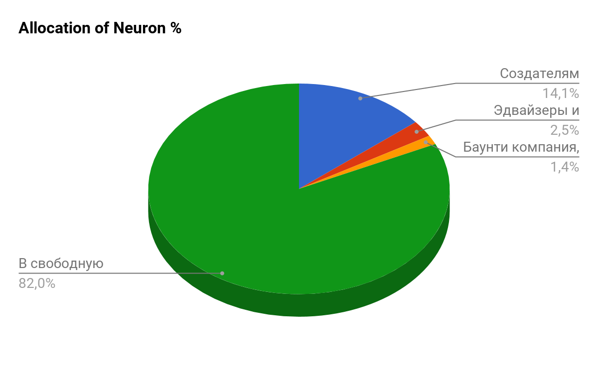

**1. ICO Structure**

| Token parameters                      |                  |
|---------------------------------------|------------------|
| Token name                            | Neuron           |
| Abbreviated name                      | NRN              |
| Number of tokens                      | NRN 8,874,150.79 |
| Token price on ETH                    | ETH 0.03         |

| Financing parameters                  |                  |
|---------------------------------------|------------------|
| Scope of financing                    | ETH 202,129.57   |

| Allocation of Neuron                  | %                |
|---------------------------------------|------------------|
| Platform founders                     | 14.1%            |
| Advisors and consultants              | 2.5%             |
| Bounty, bug detection and elimination | 1.4%             |
| Free sale through ICO                 | 82.0%            |
|                                       | 100.0%           |

**Team stimulation**

Stimulation is the practice of motivating team members to achieve the product sales target. The founders and team members will operate a three-year stimulation cycle with a payout every three months. It means that we will receive our share of tokens once in three months equal to 1/12 of tokens payable to the team.

1.1. Funding rounds

NEURON has drafted its own development plan depending on the amounts to be collected during the ICO. Since the ICO platform, the P2P exchange and the plastic card module are already operational, NEURON will be able to run some of the processes internally with respect to the further development of a payment service on a blockchain with $1.5 million as the minimum amount qualifying the company for the EMI license to launch the payment system. All subsequent stages have been planned taking into account the amount of funding.

| Funding rounds                        |                  |
|---------------------------------------|------------------|
| Stages                                | ICO Funding      |
| Licensing & accompanying fees         | "$1 500 000,00"  |
| Money remittance                      | "$3 500 000,00"  |
| Funds for regional expansion          | "$5 500 000,00"  |
| Liquidity support funds               | "$10 000 000,00" |
| NEURON Network blockchain development | "$19 000 000,00" |
| Russia office & licensing             | "$25 000 000,00" |
| Europe office & licensing             | "$36 000 000,00" |