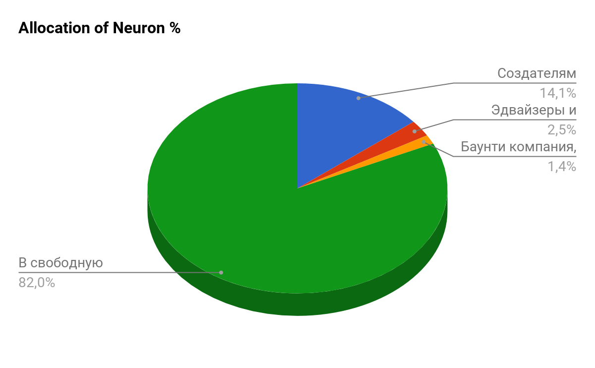

**1. Структура ICO**

| Параметры Токена                           |                  |
|--------------------------------------------|------------------|
| Название Токена                            | Neuron           |
| Сокращенное название                       | NRN              |
| Количество токенов                         | NRN 8 874 150,79 |
| Стоимость токена в ETH                     | ETH 0,03         |

| Параметры финансирования                   |                  |
|--------------------------------------------|------------------|
| Объем финансирования                       | ETH 202 129,57   |

| Распределение Neuron                       | %                |
|--------------------------------------------|------------------|
| Создателям платформы,                      | 14,10%           |
| Эдвайзеры и консультанты                   | 2,50%            |
| Баунти компания, поиск и устранение багов, | 1,40%            |
| В свободную продажу через ICO.             | 82,00%           |
|                                            | 100,00%          |

**Стимулирование команды**

Стимулирование - это практика управления интересом команды к доведению продуктва до заявленных показателей. Все основатели и команда будут иметь 3 летний стимулирующий цикл с 3 месячным шагом. Это означает, что мы будем получать свою долю токенов один раз в три месяца в размере 1/12 от количества токенов, предназначенных команде. 

1.1. Этапы финансирования

NEURON составил план собственного развития, в зависимости от суммы денежных средств, собранных в период проведения ICO. С учетом того, что площадка ICO, Р2Р биржа и модуль пластиковых карт являются уже действующими, NEURON  сможет запустить часть процессов для дальнейшего собственного развития в организации платежного сервиса на блокчейне, минимальная сумма сборов, при которой NEURON сможет обеспечить получение лицензии EMI, необходимой для организации собственной платежной системы, составляет 1,5 млн долларов США. Дальнейшие этапы развития в соответствии с объемом финансирования приведены в таблице ниже.

| Этапы финансирования                  |                  |
|---------------------------------------|------------------|
| Stages                                | ICO Funding      |
| Licensing & accompanying fees         | "$1 500 000,00"  |
| Money remittance                      | "$3 500 000,00"  |
| Funds for regional expansion          | "$5 500 000,00"  |
| Liquidity support funds               | "$10 000 000,00" |
| NEURON Network blockchain development | "$19 000 000,00" |
| Russia office & licensing             | "$25 000 000,00" |
| Europe office & licensing             | "$36 000 000,00" |