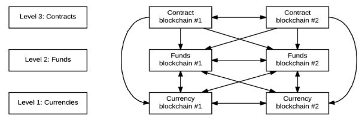
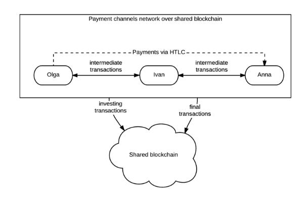

**NEURON Platform Technical Description**

Content

1. [Introduction](#_lfpmahbmyltu)
2. [Tokens](#_q9jxajobtxcp)
3. [Wallet](#_xlnse8aemu51)
4. [Consensus Mechanism](#_uidvvnzcy6jr)
	1. [General Description:](#_8dcre8h6s1p0)
		1. [Classic POI](#_1ghidjvjlufc)
		2. [Delegated Proof of Importance](#_c926b4ff9z8x)
		3. [Transactions as Proof of Stake (TaPoS)](#_8rpf9bfhfvjs)
		4. [Punishment Scheme](#_mef05gl89mf5)
		5. [Hashing Algorithm](#_php10r6yq0qf)
		6. [Block Chain and Blocks](#_s90fl1fywnzm)
		7. [Block Generation Complexity](#_khxqsodwumoi)
		8. [Block Generation](#_bstq5u8a9ud5)
		9. [Tokens and Distribution](#_idxe11orow2e)
		10. [Reward for Creating a Block](#_btvgieczv3ex)
5. [Oracles](#_juos0tkaa8vv)
6. [Security](#_lnbtg5gsu3wc)
7. [Privacy (Confidentiality)](#_r884v8gnjh91)
8. [Low Commission Fee](#_hczpz6drkdpl)
9. [NEURON Network](#_37xi9cboq9ha)
10. [Conclusion](#_tfbmh682tzhq)

#### 1. Introduction

The basic principle underlying the blockchain technology is transparency of transactions with no party without an authorized access being able to alter them. Originally developed as a self-regulating cryptocurrency circulating outside of financial institutions and bank industry, the BITCOIN system is considered to be the progenitor of the block chain technology. It used the block chain platform to record transactions of any type.

Vitalik Buterin’s project titled Etherium marked the next step in the technology development as it demonstrated the smart contracts’ Turing complete performance to the international community. Low scalability, poor security and high load on the Etherium network’s entire virtual machine were reported to be the main issues facing a smart contract.

Sidechain is a new block chain based on a parent block chain. Sidechains serve as the environment for new financial ecosystems by integrating with the existing block chains; this feature distinguishes them from other cryptocurrencies which ignore the already existing networks. With sidechains it is easy to create a rich array of smart financial contracts, shares, futures, derivatives and what not. On the basis of a block chain one can create an innumerable number of multi-goal and multi-feature sidechains whose asset structure would only depend on the volatility of the basic chain. In light of this, sidechains contribute to increasing the scope of application and extending innovation space for the block chain technology. This enables traditional block chains to support a few types of assets, small payments, smart contracts, secure transactions, real property title registration, etc. as well as to improve transaction confidentiality on a block chain. 

The NEURON Platform is a third-generation block chain which allows operating on any blockchain using quick transactions and smart contracts by removing non-critical data off of a block chain and using the NEURON Network.

#### 2. Tokens

The NEURON Platform offers a suite of tools for business applications allowing tokens to be created within a NEURON-based block chain by means of smart contracts. 

#### 3. Wallet

Each account has its own wallet, address and flow (transactions number).

The wallet is a key pair: a public and a private key.

The NEURON also allows using alias for each user. Alias is a unique combination of characters easy for human perception. A wallet administrates the NEURON private keys, creates and changes transaction statuses. One can use a wallet to submit transactions to the channel and as an application for a network of channels. 

#### 4. Consensus Mechanism

NEURON uses the updated DPOI + TaPOS hybrid consensus mechanism which allows a regular smartphone to act as a Miner and provides a high security level. Vested balance, which in NEURON ensures the weight of a vote, is calculated by means of a special algorithm and it accounts for both a user’s balance and the number of transactions they have conducted. 

#### 4.1. General Description:

#### 4.1.1 Classic POI

POI is an improved version of POS.

Unlike POS, POI not only rewards those with a large account balance, but also takes into account how much they transact to others and who they transact with.

This means that those who actively contribute to development are rewarded.

Each user is conferred a ‘trust score’, the higher it is, the more chance they have of being rewarded.

Each account is given a ‘significance score’ which proxies its aggregated value for the economy. 

Accounts given a higher significance score have a higher probability of harvesting the next block.

The POI algorithm takes into account the following parameters:

1. total balance value;
2. transactions over a fixed period of time;
3. transactions exceeding a certain threshold amount;
4. transactions with users who have been given a significance score;

POI is based on the EigenTrust++ algorithm and is an improved version of EigenTrust. EigenTrust is a reputation-based management system designed to reduce the number of downloads of inauthentic files in a P2P network. It measures the extent to which different computers within the network interact with one another based on the peer’s download history and directs traffic to the most trusted sources. Eigentrust was developed by Sep Kamvar, Mario Schlosser and Hector Garcia-Molina from Stanford University. Eigentrus++ is supposed to have a stronger resilience against Sybil attacks.

*Differences between Eigentrust++ and Eigentrust*

Eigentrust++ is more efficient than Eigentrust. 

Eigentrust++ separates reputation-based transactions from response transactions which can be unfair.

Eigentrust++ is based on the node-to-node trust expansion model and uses no single trust model.

Eigentrust++ incorporates the total number of transactions between two nodes into the difference between the number of successful and unsuccessful attempts to connect them.

#### 4.1.2. Delegated Proof of Importance

NEURON uses the Delegated Proof of Importance (DPOI) algorithm. In accordance with this algorithm, NEURON-adapted block chain token owners can choose block producers in the course of a continuous voting and anyone can decide to participate in block production and be entitled to produce the number of blocks proportional to the number of the obtained votes and the importance score relative to all other producers.

#### 4.1.3. Transactions as Proof of Stake (TaPoS)

In the NEURON protocol each transaction contains the hash title of the last known block. This prevents transactions from being repeated and provides the network with the information about blocks being currently produced.

If a producer skips a block and generates no blocks within 24 hours, they are excluded from consideration until they submit a special notification to the block chain to confirm their intention to resume work. This ensures smooth functioning of the network and minimizes the number of skipped blocks through excluding unreliable producers from the schedule. 

#### 4.1.4. Punishment Scheme

NEURON envisages a punishment scheme for block producers. If a producer starts to generate blocks in several forks simultaneously, the system automatically debits the producer’s account (deposit) in accordance with the applicable punishment scheme. Part of the fine is received by the first finder of the wrong fork. Thus, it is not financially feasible for a producer to compete with other producers and create forks.    

In case a fork does occur in the chain, the consensus algorithm will automatically switch to the longest block sequence as the speed at which blocks are added to the fork directly depends on the percentage of block producers sharing the current consensus. In other words, a block chain fork with a bigger number of producers grows longer at a quicker pace compared to a fork with a smaller number of producers.  

#### 4.1.5. Hashing Algorithm 

In the current document the H hash function always means SHA3-256 with the fixed hash length, 256 characters.

#### 4.1.6. Block Chain and Blocks

Each block contains:
1. block version
2. block time
3. producer’s public key
4. block data signature
5. previous block’s hash
6. hash for generating a new block
7. block height
8. list of transactions

The first one to be generated is the so called genesis block which is the vertical datum. 

#### 4.1.7. Block Generation Complexity

The complexity of each new block is calculated on the basis of complexities and time marks of the last blocks.

If only one block is available, complexity is set by the initial constant of complexity.

 
 
 
 
 

#### 4.1.8. Block Generation

A block producer receives a commission fee for the transactions included in the block, which motivates them to add as many transactions to the block as possible.

h = H (hash for generating a new block, public key)

t = time from the moment of the last block creation

b = emitted tokens number · (account importance) 

d = complexity

The hit and target values are calculated from these variables

A producer can generate a block on the condition that hit < target. As target is a time-dependent variable, a new block will assuredly be generated within some time.

Hit has the exponential-type distribution.

#### 4.1.9. Tokens and Distribution

NRN distribution in the first block will be defined by a smart contract on the Etherium block chain (1 Etherium token = 1 NRN). Further, NRN tokens will be harvested through mining. All system commission fees are paid in NRN, all settlement payments as part of smart contracts are made through NRN.

#### 4.1.10. Reward for Creating a Block

NEURON will reward block producers with new tokens each time they generate a new block. 

The number of tokens will be dynamically defined by delegates.

Emission is required in order to compensate for the tokens lost in the course of the system’s operation.

#### 5. Oracles

Trusted parties are needed in order to ensure interaction between a block chain and an off-chain environment. Such trusted parties will enter off-chain data into a block chain. In NEURON, this role is played by oracles. 

Any user can become an oracle. To do so, they need to put down a deposit just as in the case with block production.

There is no limit on the number of oracles in the system.

Each oracle makes a bet on the outcome. The correct outcome is selected in accordance with the consensus mechanism.

To achieve a consensus, most of the oracles must bet on the same outcome.

Oracle’s importance score is also accounted for in the consensus mechanism.

Oracles who made a bet on the right outcome get the stake back and obtain some reward. Oracles who made a bet on the wrong outcome lose that stake.

Oracles can answer a few types of questions:

- binary  yes/no

- numerical, for instance, “What is the weather like now?”

Oracles are also used for interaction with other, external block chains.

#### 6. Security

The innovation model of cryptographic data processing, using decentralization and the hybrid consensus mechanism, ensures high-level security, speed bundling efficiency and reliability at the same time. 

Enforced paths between financial institutions and Miners are used to conduct transactions on a block chain. 

Miners confirm their identities by signing blocks with digital signatures in accordance with the security protocol.

#### 7. Privacy (Confidentiality) 

For many financial institutions keeping their transactions out of public access is crucial. NEURON smart contracts only interact with a block chain where a dispute resolution is required, which qualifies them as a sort of a cryptographically secured automated arbitration proceedings platform.

#### 8. Low Commission Fee

Due to the use of an optimized block size, the consensus mechanism and state channels when executing transactions and smart contracts, the system delivers an unprecedentedly low transaction fee combined with a high-performance throughput. NEURON opens up new vistas for financial institutions and provides solutions to household issues.

#### 9. NEURON Network

In NEURON, the Lightning network-based embedded native support of state channels serves to scale up transactions and smart contracts and uses the principle of recording those transactions which opened a channel and closed it. Thus, a block chain can adapt to a flow of a few thousand transactions conducted within a few seconds with a relatively small block size and also be used to open and terminate smart contracts. The system remains decentralized and the channel structure makes it resistant against attacks and requires no trust. An improvement made on the Lightning network is adding quick and smart contracts to the state channels, which reduces extra load on the block chain and speeds up performance. This also allows creation of private smart contracts. 

NEURON Network provides a high extent of scalability in the form of hashed timelock contracts, HTLCs. These contracts enable users to effect payments while there is no open communication channel by using one or more intermediate nodes. 

#### 10. Conclusion.

Currently NEURON Platform and NEURON Network are being actively explored and developed and, therefore, the information published in this technical description is subject to revision in later versions (the data will be amended and altered periodically). The tests and analysis conducted testify to the feasibility of this project.
