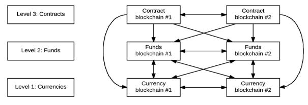
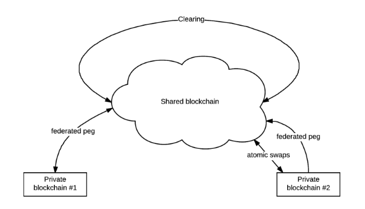
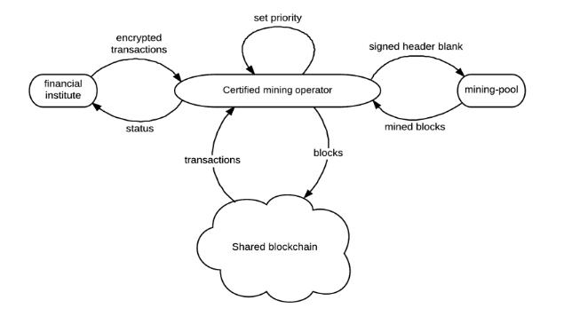
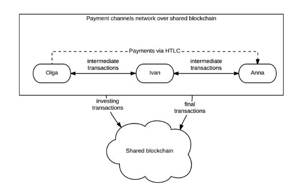

**Техническое описание NEURON Platform**

Оглавление

1. [Введение](#_lfpmahbmyltu)
2. [Токены](#_q9jxajobtxcp)
3. [Кошелек](#_xlnse8aemu51)
4. [Механизм консенсуса](#_uidvvnzcy6jr)
	1. [Общее описание:](#_8dcre8h6s1p0)
		1. [Классический POI](#_1ghidjvjlufc)
		2. [Delegated Proof of Importance](#_c926b4ff9z8x)
		3. [Транзакции как Доказательство Владения Долей \(TaPoS\)](#_8rpf9bfhfvjs)
		4. [Штраф](#_mef05gl89mf5)
		5. [Алгоритм хеширования](#_php10r6yq0qf)
		6. [Блокчейн и блоки](#_s90fl1fywnzm)
		7. [Сложность создания блока](#_khxqsodwumoi)
		8. [Создание блока](#_bstq5u8a9ud5)
		9. [Токены и распределение](#_idxe11orow2e)
		10. [Вознаграждение за блок](#_btvgieczv3ex)
5. [Оракулы](#_juos0tkaa8vv)
6. [Безопасность](#_lnbtg5gsu3wc)
7. [Конфиденциальность](#_r884v8gnjh91)
8. [Низкая комиссия](#_hczpz6drkdpl)
9. [NEURON Network](#_37xi9cboq9ha)
10. [Заключение\.](#_tfbmh682tzhq)

#### 1. Введение

Основным принципом функционирования технологии блокчейн является прозрачность совершаемых операций с невозможностью их изменения лицами, не имеющими к ней санкционированного доступа. Родоначальницей технологии блокчейн считается система "Биткойн", в свое время созданная в виде саморегулирующейся криптовалюты, не требующей обслуживания финансовыми организациями и банками. Она использовала платформу блокчейн для учета транзакций любого типа. 

Следующем этапом развития стал проект Виталика Бутерина под названием Etherium, продемонстрировавший миру работу тьюринг полных умных контрактов. Проблемой смарт-контрактов стала низкая масштабируемость, безопасность и высокая нагрузка на всю виртуальную машину сети Etherium.

Сайдчейн (sidechain) — это новый блокчейн, базирующийся на родительской блокчейн-цепочке. Сайдчены реализуют новые финансовые экосистемы посредством интеграции в существующие блокчейн-цепочки, что отличает их от других криптовалют, игнорирующих уже существующие сети. Используя сайдчейны, с легкостью можно создавать разного рода умные финансовые контракты, акции, фьючерсы, деривативы и многое другое. На базе блокчейна можно создать бесчисленное множество сайдчейнов с разными задачами и особенностями, активы которых будут зависеть от волатильности основной цепи. Основываясь на этом, сайдчейн способствует дальнейшему расширению области применения и инновационного пространства для технологии блокчейн. Это позволяет традиционным блокчейн поддерживать несколько видов активов, небольшие платежи, умные контракты, безопасное проведение транзакций, регистрацию прав реальной собственности и др., а также увеличивает степень конфиденциальности блокчейн-транзакций.

Платформа NEURON является блокчейном третьего поколения, позволяющая работать с любыми блокчейнами, используя быстрые транзакции и смарт-контракты за счет выноса некритичных данных из блокчейна и использованием сети NEURON Network.

#### 2. Токены

Платформа NEURON предлагает удобный инструментарий для бизнес-приложений, позволяющий создавать токены внутри блокчейна NEURON посредством умных контрактов.

#### 3. Кошелек

Каждый аккаунт имеет свой кошелек, адрес и flow (количество транзакций).

Кошелек является парой ключей. Публичный и закрытый ключ.

Система NEURON позволяет также использовать алиасы для каждого пользователя. Алиас это уникальный набор символов удобный для восприятия человеком. Кошелек управляет приватными ключами NEURON, создает и меняет статусы транзакций и сделок. Кошелек можно использовать для отправки транзакций в канал и использовать как приложение для сети каналов.

#### 4. Механизм консенсуса

В NEURON используется модернизированный гибридный механизм консенсуса DPOI + TaPOS, позволяющий выступать в роли майнеров обычному смартфону, обеспечивающий высокий уровень безопасности. Vested balance в NEURON, обеспечивающий вес голоса, рассчитывается посредством специального алгоритма и учитывает как баланс пользователя, так и количество осуществленных им транзакций. 

#### 4.1. Общее описание:

#### 4.1.1 Классический POI

POI является улучшением POS.

В отличии от POS, система POI не только вознаграждает тех, у кого большой баланс счета, но также учитывает, насколько каждый пользователь взаимодействует с другими пользователями и с кем он совершает сделки.

Это означает, что те, кто активно участвует в развитии, получают вознаграждение.

Каждому пользователю присваивается "оценка доверия", и, чем она выше, тем больше шансов получить вознаграждение.

Каждой учетной записи присваивается оценка важности, которая проксирует ее совокупное значение для экономики.

Счета с более высокой оценкой важности, имеют более высокую вероятность для создания следующего блока 

В POI учитываются такие показатели как

1. сумма баланса;
2. транзакции за фиксированный период;
3. транзакции больше некоторого порогового значения;
4. транзакции участникам, имеющим оценку важности;

POI построен на EigenTrust++ алгоритме и является улучшенной версией EigenTrust. EigenTrust - это репутационная система, которая разработана с целью уменьшения количества загрузок неаутентифицированных файлов из P2P-сети. Он измеряет, насколько разные компьютеры в сети взаимодействуют друг с другом, основываясь на истории загрузок партнера и направляет трафик в наиболее надежные источники. Eigentrust был разработан Sep Kamvar, Mario Schlosser и Hector Garcia-Molina из Стэнфордского университета. Предполагается, что Eigentrus++ обладает большей устойчивостью к Sybil-атакам.

*Отличие Eigentrust++ от Eigentrust*

Eigentrust++ эффективнее Eigentrust. 

Eigentrust++ отделяет транзакции, основанные на репутации, от ответных транзакций, которые могут быть недобросовестными.

Eigentrust++ основан на модели распространения доверия от узла к узлу и не использует единую модель доверия.

Eigentrust++ в разность между количествами успешных и неуспешных попыток коннекта двух узлов инкорпорирует общее количество транзакций между ними.

#### 4.1.2. Delegated Proof of Importance

NEURON использует Делегированное Доказательство Важности (Delegated Proof of Importance, DPOI). Согласно этому алгоритму, обладатели токенов блокчейна, адаптированного под NEURON, могут выбирать производителей блоков в ходе непрекращающегося голосования, и любой может решить участвовать в производстве блоков и получить право произвести количество блоков, пропорциональное полученному количеству голосов и важности относительно всех других производителей.

#### 4.1.3. Транзакции как Доказательство Владения Долей \(TaPoS\)

В протоколе NEURON каждая транзакция содержит хэш заголовка последнего известного блока. Это позволяет предотвратить повторение транзакций, а также дает информацию сети о том какие блоки сейчас производятся.

Если производитель пропускает блок и не производит ни одного блока в течение 24 часов, то он исключается из рассмотрения до специального уведомления, которое такой производитель должен послать в блокчейн для подтверждения намерения продолжения работы. Это обеспечивает слаженную работу сети и минимизирует количество пропускаемых блоков путем исключения не надежных производителей из расписания.

#### 4.1.4. Штраф

В NEURON предусмотрена система штрафов для производителей блоков. Если производитель начинает производить блоки для нескольких веток одновременно, система в автоматическом режиме списывает со счета (депозита) производителя средства в сумме штрафа. Часть штрафа в виде вознаграждения получает первый нашедший неверную ветку. Таким образом производителю экономически не выгодно конкурировать с другими производителями и создавать ветвления.

В случае, если ветвление цепи все-таки произойдет, алгоритм консенсуса автоматически переключится на самую длинную последовательность блоков, поскольку скорость добавления блоков в ветку цепи напрямую зависит от процента разделяющих текущий консенсус производителей блоков. Другими словами, ветка блокчейна с большим количеством производителей “растет” в длину быстрее в сравнении с веткой с меньшим количеством производителей.

#### 4.1.5. Алгоритм хеширования

В текущем документе хэш функция H всегда означает SHA3-256 с фиксированной длиной хеша, 256 символов

#### 4.1.6. Блокчейн и блоки

Каждый блок содержит:
1. версия блока
2. время блока
3. публичный ключ производителя
4. подпись данных блока
5. хэш предыдущего блока
6. хэш для генерации нового блока
7. высота блока
8. список транзакций

первым будет создан так называемый genesis блок, все отсчеты высоты происходят от него.

#### 4.1.7. Сложность создания блока

Сложность для каждого нового блока вычисляется на основе сложностей и временных меток последних блоков.

Если доступен только один блок, то сложность задается начальной константой сложности.

 **Ошибка**  (сложность i-того блока)(средняя сложность)

  (время на создание i-того блока) (среднее время создания блока)

 сложность = d x (n x (последних блоков)) / t (новая сложность)

#### 4.1.8. Создание блока

Производитель блока получает комиссию за транзакции включенные в блок\.

Это мотивирует производителя добавлять в блок как можно больше транзакций

h = H\(хэш для генерации нового блока, публичный ключ\)

t = время с момента создания последнего блока

b = количество эмитированных токенов · \(важность аккаунта\) 

d = сложность

из этих переменных рассчитываются hit и target значения

**Ошибка** 

производитель может создать блок если hit < target. Так как target зависит от времени, новый блок будет гарантировано создан за некоторое время.

hit имеет экспоненциальное распределение.

#### 4.1.9. Токены и распределение

Распределение NRN в первом блоке будет определяться смарт-контрактом на блокчейне Ethereum (1 токен эфириума = 1 NRN). Последующие поступление NRN будет обеспечиваться путём майнинга. Все системные комиссии оплачиваются в NRN, все взаиморасчеты в рамках умных контрактов производятся посредством NRN.

#### 4.1.10. Вознаграждение за блок

NEURON будет вознаграждать производителя блоков новыми токенами каждый раз, когда он производит блок. 

Количество токенов будет динамически определяться делегатами.

Эмиссия необходима, чтобы покрыть утерянные токены в процессе функционирования системы.

#### 5. Оракулы

Для взаимодействия блокчейна с внешней средой нужны доверенные источники информации, которые будут вносить данные из внешней среды в блокчейн. В NEURON это оракулы. 

Оракулом может стать любой пользователь сети, для этого необходимо так же как и в случае производства внести депозит.

Количество оракулов в системе неограниченно.

Каждый оракул делает ставку на ответ. Правильный ответ выбирается согласно механизму консенсуса.

Для консенсуса большая часть оракулов должна поставить на один ответ.

Также в механизме консенсуса участвует показатель важности оракула.

Оракулы поставившие на верный ответ получают назад ставку и некоторое вознаграждение. Оракулы поставившие на неверный ответ, теряют ставку.

Оракулы могут ответить на несколько типов вопросов:
- бинарные да\нет
- числовые, например, какая сейчас погода?

Оракулы используются также для взаимойдествия с внешними блокчейнами

#### 6. Безопасность

Инновационная модель криптографической обработки данных, использование децентрализации и гибридного механизма консенсуса обеспечивает высокий уровень безопасности, скорости, сочетая в себе эффективность и надежность.

Для размещения транзакций на блокчейне используются защищенные каналы связи между финансовыми учреждениями и майнерами. 

Майнеры подтверждают свою личность, подписывая блоки цифровыми подписями в соответствии с протоколом безопасности

#### 7. Конфиденциальность

Для многих финансовых организаций важной частью является возможность хранения транзакций вне публичного доступа. Умные контракты NEURON взаимодействуют с блокчейном только в случае необходимости разрешения разногласий, что позволяет им действовать в качестве своего рода криптографически защищенного автоматизированного арбитражного судопроизводства.

#### 8. Низкая комиссия

Благодаря использованию оптимизированного размера блока, механизма консенсуса и каналов состояний для транзакций и смарт контрактов система обеспечивает беспрецедентно низкую стоимость  транзакций вместе с огромной пропускной способностью\. NEURON открывает новые границы для финансовых институтов и бытовых решений\.

#### 9. NEURON Network

В NEURON, встроенная нативная поддержка каналов состояния на основе Lightning network, служит для масштабирования транзакций и смарт-контрактов и работает по принципу записи в блокчейн транзакций, создавших канал и закрывших его. Таким образом блокчейн может адаптироваться к потоку в тысячи транзакций в секунды при небольшом размере блока, а также использоваться при открытии и завершении смарт-контрактов. Система остается децентрализованной и структура канала делает его устойчивым к намерениям злоумышленников и не требует доверия. Улучшением Lightning network является добавление быстрых умных контрактов в каналы состояния, что позволяет убрать лишнюю нагрузку на блокчейн и ускорить их выполнение. Это также позволяет создавать приватные умные контракты.

NEURON Network предоставляет высокую степень масштабируемости в форме временных контрактов на основе хэшей (англ. hashed timelock contracts, HTLCs). Эти контракты предоставляют возможность пользователям проводить платежи при отсутствии открытого канала связи, используя один или несколько промежуточных узлов.

#### 10. Заключение\.

На текущий момент NEURON Platform и NEURON Network находяться в активном режиме разработки, поэтому информация, опубликованная в настоящем техническом описании, будет обновляться по ходу выпуска обновлений. (данные будут периодически правиться и меняться.) 

