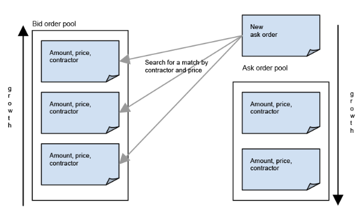
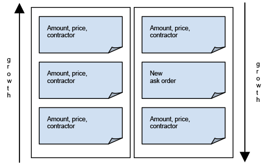
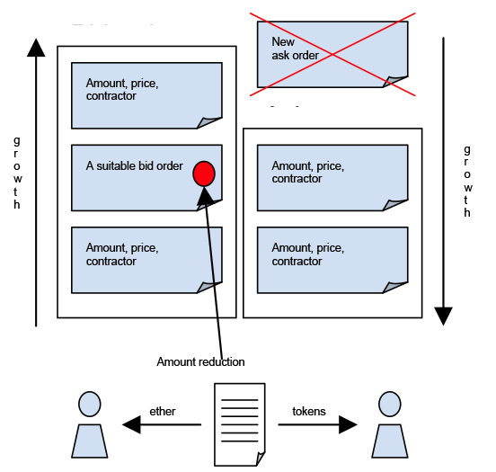
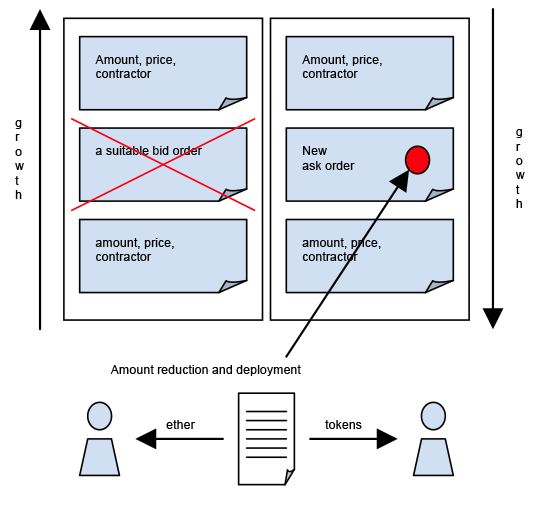
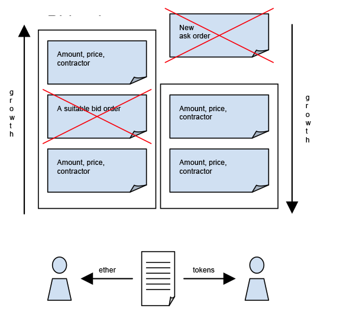

# Table of contents

[__Overview__](#_2bjgrla6dabd)

[__Business logic of a contract__](#_54ugle38jyqu)

[ERC\-20](#_cqav7gktx43p)

[Token](#_bjkm669lcrot)

[Exchange functionality: Bid/Ask orders](#_op55jc1tnmk8)

[__Illustration of the exchange contract algorithm__](#_2e1d1vfiz51o)

[1\. The placement of a new ask contract](#_zb8eu0m824g7)

[2a\. Placing an order, where there is no match by contractor or price](#_c6smojp0mukk)

[2b\. Partial bid satisfaction](#_ry2i8fl7x9zq)

[2c Partial ask satisfaction](#_jnn8r29or0su)

[2d Mutual bid and ask satisfaction](#_3vgbdr5mwqic)

[__Testing a token exchange contract__](#_wwgumexnkegq)

# 

# 

# 

# 1\. Overview

An exchange token contract has been developed on the basis of a Token contract, which already featured all necessary token usage functionality, a set of protection measures against vulnerabilities and the ability to read the entire contract state\.

# 2\. Business logic of a contract

## 2\.1\. ERC\-20

2.1.1. A contract is issued with a fixed number of tokens;

2.1.2. A shareholder transfers tokens to a wallet of his choice;

2.1.3. A shareholder allows another wallet owner to debit his tokens \(*incur* expenses\);

2.1.4. Tokens are transferred from someone else's wallet to a random wallet within the limits specified by the owner of the wallet, to which these tokens are attached\.

## 2\.2\. Token

2\.2\.1 	Information is provided to the contract owner with regards to the balances of all shareholders\.

# 3\. Exchange functionality: Bid/Ask orders

3.1.1. Anyone can put tokens on sale at a desired price and the contract guarantees that a token will be sold at a price not lower than the desired one\. Upon the creation of an order, tokens are immediately written off from the seller's account in order to exclude the possibility of a multiple sale\.

3.1.2. Anyone can announce an intention to buy a required amount of tokens at a desired price and the contract guarantees that tokens will be purchased at a price not higher than the desired one\. Upon the creation of an order, it is necessary to pay for the transaction in advance in ether amounting to at least the price of the order\.

3.1.3. In a created order, one can specify a contracting shareholder with whom an exchange will be made\. If a shareholder is not specified, the order is created against the entire token market\.

3.1.4. Where there are counter orders, suitable in terms of price and contractor, their requirements shall be satisfied by crediting the tokens to the ask order owner and transferring ether to the bid order owner amounting to the smallest of the orders, which is afterwards removed from the pool because of the full satisfaction of its requirements\. The amount of a counter order is reduced by the amount of a conducted transaction, or is removed from the pool if it has been completely satisfied\.

3.1.5. An attempt to satisfy the orders shall be made at the time of placing a new order\.

3.1.6. Each order has a unique identifier which allows the order owner or the contract owner to see the details of the order or cancel it\.

3.1.7. For convenience, each shareholder may obtain the list of his/her orders, and the contract owner may obtain the list of all orders\.

# 4\. Illustration of the exchange contract algorithm

Placement of a new purchase order is considered as an example\. In case of sale, the algorithm operates symmetrically\.

## __4\.1\. The placement of a new ask contract__

## __4\.2 Placing an order, where there is no match by contractor or price__

## __4\.3\. Partial bid satisfaction__

## __4\.4\. Partial ask satisfaction__

## __4\.5\. Mutual bid and ask satisfaction__

 

# 5\. Testing a token exchange contract

 

Three accounts have been used to test tokens: zero account for the miner, account 1 for the contract owner and account 2 for the second party to contract transactions\.

 

The following automated tests have been prepared\.

1\.	Compiling and deploying a contract on the blockchain\.

2\.	Verifying the contract status after it has been created\.

1. Verification inherited from the basic contract\.
2. Verification for absence of orders\.

3\.	Verifying a possibility of creating a sell order\.

1. Calling a method of sales order creation\.
2. Verifying the list of orders for inclusion of the created order\.

4\.	Verifying the possibility of creating a sell order for the contractor\.

1. Calling a method of creating an order with a contractor specified
2. Verifying the list of orders for inclusion of the created order\.

5\.	Verifying the possibility of creating a purchase order\.

1. Calling a method for creating a purchase order\.
2. Verifying the list of orders for inclusion of the created order\.

6\.	Verifying the possibility of creating an order of purchase from the contractor\.

1. Calling a method for creating an order of purchase from the contractor\.
2. Verifying the list of orders for inclusion of the created order\.

7\.	Verifying the impossibility of selling tokens in excess of the amount held on the balance\.

1. Calling a method of sales order creation\.
2. Verifying the list of orders for absence of the created order\.

8\.	Verifying the impossibility of creating tokens in excess of the amount held at the contractor’s balance\.

1. Calling a method of creating an order with a contractor specified
2. Verifying the list of orders for absence of the created order\.

9\.	Verifying the impossibility of purchase in case of incomplete payment for the transaction\.

1. Calling a method for creating a purchase order\.
2. Verifying the list of orders for absence of the created order\.

10\.  Verifying the impossibility of purchase from the contractor in case of incomplete payment for the transaction\.

1. Calling a method for creating an order of purchase from the contractor\.
2. Verifying the list of orders for absence of the created order\.

11\.  Verifying the ask order matching the bid order\.

1. Ask order creation\.
2. Bid order creation\.
3. Verifying the absence of both orders and transfer of tokens from the bid order owner to the ask order owner and transfer of ether in the opposite direction\.

12\.  Verifying the bid order matching the ask order\.

1. Bid order creation\.
2. Ask order creation\.
3. Verifying the absence of both orders and transfer of tokens from the bid order owner to the ask order owner and transfer of ether in the opposite direction\.

13\.  Verifying the big ask order matching the small bid order\.

1. Ask order creation\.
2. Bid order creation\.
3. Verifying for the absence of bid order, a proportionate reduction in ask order, and transfer of tokens from bid order owner to ask order owner and transfer of ether in the opposite direction\.

14\.  Verifying the big bid order matching the small ask order\.

1. Bid order creation\.
2. Ask order creation\.
3. Verifying for the absence of ask order, a proportionate reduction in bid order, and transfer of tokens from the bid order owner to the ask order owner and transfer of ether in the opposite direction\.

15\.  Verifying the small ask order matching the big bid order\.

1. Ask order creation\.
2. Bid order creation\.
3. Verifying the absence of ask order, a proportionate reduction in bid order, and transfer of tokens from the bid order owner to the ask order owner and transfer of ether in the opposite direction\.

16\.  Verifying the small bid order matching big ask order\.

1. Bid order creation\.
2. Ask order creation\.
3. Verifying for the absence of bid order, proportionately to the reduction of ask order, and transfer of tokens from bid order owner to ask order owner and transfer of ether in the opposite direction\.

17\.  Verifying that a specified contractor’s bid order matches the ask order of the same\.

1. Creating a bid order specifying a contractor\.
2. Creating an ask order on behalf of a contractor\.
3. Verifying that orders match and tokens are transferred from the bid order owner to the ask order owner and transfer of ether in the opposite direction\.

18\.  Verifying that a specified contractor’s ask order matches the bid order of the same\.

1. Creating an ask order specifying a contractor\.
2. Creating a bid order on behalf of a contractor\.
3. Verifying that orders match and tokens are transferred from the bid order owner to the ask order owner and transfer of ether in the opposite direction\.

19\.  Verifying that the bid order matches the ask order of a specified contractor\.

1. Bid order creation\.
2. Creating an ask order specifying the bid order owner as the contractor\.
3. Verifying that orders match and tokens are transferred from the bid order owner to the ask order owner and transfer of ether in the opposite direction\.

20\.  Verifying that the ask order matches the bid order of a specified contractor\.

1. Ask order creation\.
2. Creating a bid order specifying the ask order owner as the contractor\.
3. Verifying that the orders match and tokens are transferred from the bid order owner to the ask order owner and transfer of ether in the opposite direction\.

21\.  Verifying that the bid order matches the ask order where contractors are counter\-specified\.

1. Creating an ask order specifying a contractor\.
2. Creating bid orders on behalf of ask order contractor specifying the ask order owner as the contractor\.
3. Verifying that the orders match and tokens are transferred from the bid order owner to the ask order owner and transfer of ether in the opposite direction\.

22\.  Verifying that the ask order matches the bid order where contractors are counter\-specified\.

1. Creating a bid order with the contractor specified\.
2. Creating an ask order on behalf of bid order contractor specifying the bid order owner as the contractor\.
3. Verifying that the orders match and tokens are transferred from the bid order owner to the ask order owner and transfer of ether in the opposite direction\.

23\.  Verifying the operability of the by\-contractor order match condition; ask after bid\.

1. Creating a bid order specifying a third person as the contractor\.
2. Creating an ask order specifying a third person as a contractor\.
3. Verifying both orders in the form, in which they were created, and the absence of token balance change\.

24\.  Verifying the operability of the by\-contractor order match condition, bid after ask\.

1. Creating an ask order specifying a third person as a contractor\.
2. Creating a bid order specifying a third person as a contractor\.
3. Verifying that both orders are available in the form, in which they were created, and the absence of token balance change\.

 

25\.  Verifying the operability of the by\-price order match condition, ask after bid\.

1. Creating a bid order with a higher price\.
2. Creating an ask order with a lower price\.
3. Verifying that both orders are available in the form, in which they were created, and the absence of token balance change\.

26\.  Verifying the operability of the by\-price order match condition, bid after ask\.

1. Creating a ask order with a lower price\.
2. Creating a bid order with a higher price\.
3. Checking that both orders are available in the form, in which they were created, and the absence of token balances change\.

The success of almost all tests could be attributed to the contract’s extra feature of obtaining all the orders\. The contract owner is only allowed to employ the methods\. Any other shareholder only has access to his orders\.

 

 

 

