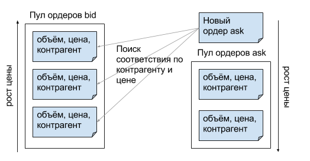
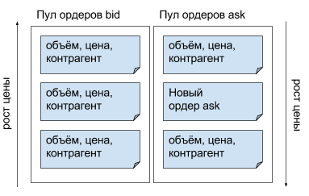
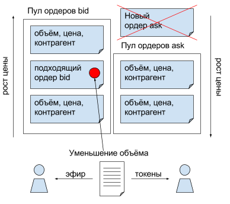
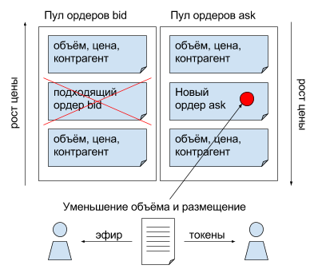
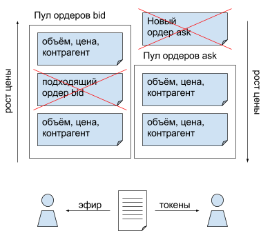

Токенный биржевой контракт

Оглавление

1. [Обзор](#_vcp3ki8rnfq3)
2. [Бизнес\-логика контракта](#_b9unzwts56rl)
	
	2.1. [ERC\-20](#_15x3vx936ar)
	
	2.2. [Token](#_t3gp0rpiw5a)

3. [Функционал биржи с ордерами Bid/Ask](#_i3hfqdy0lday)
4. [Иллюстрация алгоритма работы биржевого контракта](#_m2nmsw4gf7bm)
	
	4.1. [Поступление нового контракта ask](#_3xbk8m537y9t)
	
	4.2. [Размещение ордера, если нет совпадения по контрагенту или цене](#_wftxztl59lo4)
	
	4.3. [Частичное удовлетворение bid](#_j1psckduft42)
	
	4.4. [Частичное удовлетворение ask](#_182z1lli7bcq)
	
	4.5. [Взаимное удовлетворение bid и ask](#_2asyqgkeattg)

5. [Тестирование токенного биржевого контракта\.](#_uwwrzqsju8f7)

#### 

#### 1. Обзор

Токенный контракт был реализован на базе контракта Token, где была реализована вся необходимая функциональность по работе с токенами, ряд защит от уязвимостей и возможность чтения всего состояния контракта\.

#### 2. Бизнес\-логика контракта

#### 2.1. ERC\-20

- 
	- 
		1. Выпуск контракта с фиксированным количеством токенов;
		2. Перевод токенов акционером на произвольный кошелёк;
		3. Разрешение акционером списания \(траты\) его токенов владельцу другого кошелька;
		4. Перевод токенов с чужого кошелька на произвольный кошелёк в рамках, заданных владельцем кошелька, к которому эти токены привязаны\.

#### 2.2. Token

- 
	2.2.1. Предоставление владельцу контракта информации о балансах всех акционеров

#### 2.3. Функционал биржи с ордерами Bid/Ask

- 
	
	3.1. Каждый может выставить токены на продажу по желаемой цене, контракт гарантирует, что токен будет продан по цене не ниже желаемой\. При создании ордера токены списываются со счёта продавца немедленно, чтобы исключить возможность многократной продажи\.
	
	3.2. Каждый может объявить о желании купить необходимое количество токенов по желаемой цене, контракт гарантирует, что токены будут куплены по цене не выше желаемой\. При создании ордера необходимо оплатить операцию эфиром заранее, объёмом не меньше цены ордера\.
	
	3.3. В любом ордере можно указывать контрагента — акционера, с которым требуется обмен\. Если акционер не указан, ордер выставляется против всего рынка токенов\.
	
	3.4. При наличии встречных ордеров, подходящих по цене и контрагенту, требования их удовлетворяются путём зачисления токенов владельцу ордера ask, и перечисления эфира владельцу ордера bid в объёме наименьшего из ордеров, который затем удаляется из пула в связи с полным удовлетворением его требований\. Объём встречного ордера уменьшается на объём проведённой сделки, или удаляется из пула, если тоже удовлетворён полностью\.
	
	3.5. Попытка удовлетворения ордеров производится на момент размещения нового ордера\.
	
	3.6. Каждый ордер имеет уникальный идентификатор, по которому владелец ордера или контракта может посмотреть детали ордера или отменить его\.
	
	3.7. В целях удобства, каждый акционер может получить список своих ордеров, а владелец контракта — всех ордеров\.

#### 4. Иллюстрация алгоритма работы биржевого контракта

В качестве примера рассмотрено поступление нового ордера на покупку\. В случае продажи алгоритм работает симметрично\.

#### Поступление нового контракта ask

#### Размещение ордера, если нет совпадения по контрагенту или цене

#### Частичное удовлетворение bid

#### Частичное удовлетворение ask

#### Взаимное удовлетворение bid и ask

#### Тестирование токенного биржевого контракта\.

Для тестирования использовались три аккаунта: нулевой для майнера, первый — владелец контракта, второй — вторая сторона для контрактных транзакций\.

Были подготовлены следующие автоматические тесты\.

1. Компиляция и размещение контракта в блокчейне\.
2. Проверка состояния контракта после создания\.
	1. Проверка, унаследованная от базового контракта\.
	2. Проверка отсутствия ордеров\.
3. Проверка возможности создания ордера на продажу\.
	1. Вызов метода создания ордера на продажу\.
	2. Проверка списка ордеров на предмет наличия создаваемого ордера\.
4. Проверка возможности создания ордера на продажу контрагенту\.
	1. Вызов метода создания ордера с указанием контрагента\.
	2. Проверка списка ордеров на предмет наличия создаваемого ордера\.
5. Проверка возможности создания ордера на покупку\.
	1. Вызов метода создания ордера на покупку\.
	2. Проверка списка ордеров на предмет наличия создаваемого ордера\.
6. Проверка возможности создания ордера на покупку у контрагента\.
	1. Вызов метода создания ордера на покупку у контрагента\.
	2. Проверка списка ордеров на предмет наличия создаваемого ордера\.
7. Проверка невозможности продажи бо́льшего количества токенов, чем есть на балансе\.
	1. Вызов метода создания ордера на продажу\.
	2. Проверка списка ордеров на предмет отсутствия создаваемого ордера\.
8. Проверка невозможности создания бо́льшего количества токенов, чем есть на балансе контрагенту\.
	1. Вызов метода создания ордера с указанием контрагента\.
	2. Проверка списка ордеров на предмет отсутствия создаваемого ордера\.
9. Проверка невозможности покупки при неполной оплате операции\.
	1. Вызов метода создания ордера на покупку\.
	2. Проверка списка ордеров на предмет отсутствия создаваемого ордера\.
10. Проверка невозможности покупки у контрагента при неполной оплате операции\.
	1. Вызов метода создания ордера на покупку у контрагента\.
	2. Проверка списка ордеров на предмет отсутствия создаваемого ордера\.
11. Проверка удовлетворения ордером ask ордера bid\.
	1. Создание ордера ask\.
	2. Создание ордера bid\.
	3. Проверка отсутствия обоих ордеров и перехода токенов от владельца ордера bid владельцу ордера ask, и эфира в обратном направлении\.
12. Проверка удовлетворения ордером bid ордера ask\.
	1. Создание ордера bid\.
	2. Создание ордера ask\.
	3. Проверка отсутствия обоих ордеров и перехода токенов от владельца ордера bid владельцу ордера ask, и эфира в обратном направлении\.
13. Проверка удовлетворения большим ордером ask малого ордера bid\.
	1. Создание ордера ask\.
	2. Создание ордера bid\.
	3. Проверка отсутствия ордера bid, соразмерного уменьшения ордера ask, и перехода токенов от владельца ордера bid владельцу ордера ask, а эфира в обратном направлении\.
14. Проверка удовлетворения большим ордером bid малого ордера ask\.
	1. Создание ордера bid\.
	2. Создание ордера ask\.
	3. Проверка отсутствия ордера ask, соразмерного уменьшения ордера bid, и перехода токенов от владельца ордера bid владельцу ордера ask, а эфира в обратном направлении\.
15. Проверка удовлетворения малым ордером ask большого ордера bid\.
	1. Создание ордера ask\.
	2. Создание ордера bid\.
	3. Проверка отсутствия ордера ask, соразмерного уменьшения ордера bid, и перехода токенов от владельца ордера bid владельцу ордера ask, а эфира в обратном направлении\.
16. Проверка удовлетворения малым ордером bid большого ордера ask\.
	1. Создание ордера bid\.
	2. Создание ордера ask\.
	3. Проверка отсутствия ордера bid, соразмерного уменьшения ордера ask, и перехода токенов от владельца ордера bid владельцу ордера ask, а эфира в обратном направлении\.
17. Проверка удовлетворения ордера bid с указанным контрагентом ордером ask этого контрагента\.
	1. Создание ордера bid с указанием контрагента\.
	2. Создание ордера ask от лица этого контрагента\.
	3. Проверка удовлетворения ордеров и перехода токенов от владельца ордера bid владельцу ордера ask, и эфира в обратном направлении\.
18. Проверка удовлетворения ордера ask с указанным контрагентом ордером bid этого контрагента\.
	1. Создание ордера ask с указанием контрагента\.
	2. Создание ордера bid от лица этого контрагента\.
	3. Проверка удовлетворения ордеров и перехода токенов от владельца ордера bid владельцу ордера ask, и эфира в обратном направлении\.
19. Проверка удовлетворения ордера bid ордером ask с указанным контрагентом\.
	1. Создание ордера bid\.
	2. Создание ордера ask с указанием в качестве контрагента владельца ордера bid\.
	3. Проверка удовлетворения ордеров и перехода токенов от владельца ордера bid владельцу ордера ask, и эфира в обратном направлении\.
20. Проверка удовлетворения ордера ask ордером bid с указанным контрагентом\.
	1. Создание ордера ask\.
	2. Создание ордера bid с указанием в качестве контрагента владельца ордера ask\.
	3. Проверка удовлетворения ордеров и перехода токенов от владельца ордера bid владельцу ордера ask, и эфира в обратном направлении\.
21. Проверка удовлетворения ордера bid ордером ask, при встречном указании контрагентов\.
	1. Создание ордера ask с указанием контрагента\.
	2. Создание ордера bid от лица контрагента ордера ask с указанием в качестве контрагента владельца ордера ask\.
	3. Проверка удовлетворения ордеров и перехода токенов от владельца ордера bid владельцу ордера ask, и эфира в обратном направлении\.
22. Проверка удовлетворения ордера ask ордером bid, при встречном указании контрагентов\.
	1. Создание ордера bid с указанием контрагента\.
	2. Создание ордера ask от лица контрагента ордера bid с указанием в качестве контрагента владельца ордера bid\.
	3. Проверка удовлетворения ордеров и перехода токенов от владельца ордера bid владельцу ордера ask, и эфира в обратном направлении\.
23. Проверка работы условия удовлетворения ордеров по контрагенту, ask после bid\.
	1. Создание ордера bid с указанием в качестве контрагента третьего лица\.
	2. Создание ордера ask с указанием в качестве контрагента третьего лица
	3. Проверка наличия обоих ордеров в том виде, в каком они были созданы, и отсутствия изменения токенных балансов\.
24. Проверка работы условия удовлетворения ордеров по контрагенту, bid после ask\.
	1. Создание ордера ask с указанием в качестве контрагента третьего лица
	2. Создание ордера bid с указанием в качестве контрагента третьего лица\.
	3. Проверка наличия обоих ордеров в том виде, в каком они были созданы, и отсутствия изменения токенных балансов\.
25. Проверка работы условия удовлетворения ордеров по цене, ask после bid\.
	1. Создание ордера bid с высокой ценой\.
	2. Создание ордера ask с низкой ценой\.
	3. Проверка наличия обоих ордеров в том виде, в каком они были созданы, и отсутствия изменения токенных балансов\.
26. Проверка работы условия удовлетворения ордеров по цене, bid после ask\.
	1. Создание ордера ask с низкой ценой\.
	2. Создание ордера bid с высокой ценой\.
	3. Проверка наличия обоих ордеров в том виде, в каком они были созданы, и отсутствия изменения токенных балансов\.

Почти все тесты стало возможным провести благодаря тому, что в контракте дополнительно реализована возможность получения всех ордеров\.

Данные методы разрешено использовать только владельцу контракта\. Любой другой акционер имеет доступ только к своим ордерам\.

