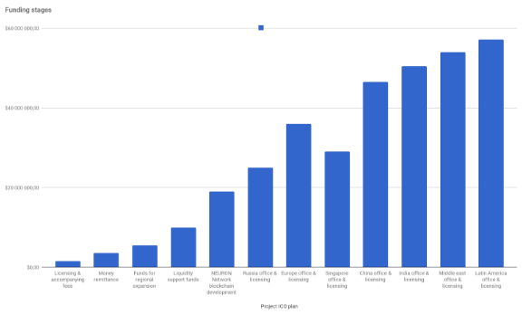

__NEURON: Funding rounds__

1. Table

NEURON has drafted its own development plan depending on the amounts to be collected during the ICO with $1\.5 million being the minimum amount that would qualify the company for a payment system license\. Since the ICO platform, the P2P exchange and the plastic card module are already operational, NEURON will be able to run some of the processes internally with respect to further development of a payment service on a blockchain\. All subsequent stages have been planned taking into account the amount of funding\.

| **Funding rounds**                    |                   |
|---------------------------------------|-------------------|
| **Stages**                            | **ICO Funding**   |
| Licensing & accompanying fees         | "$1 500 000,00"   |
| Money remittance                      | "$3 500 000,00"   |
| Funds for regional expansion          | "$5 500 000,00"   |
| Liquidity support funds               | "$10 000 000,00"  |
| NEURON Network blockchain development | "$19 000 000,00"  |
| Russia office & licensing             | "$25 000 000,00"  |
| Europe office & licensing             | "$36 000 000,00"  |

2. Diagram 1 \-  Investment in the project by rounds \- collection plan and development stages

