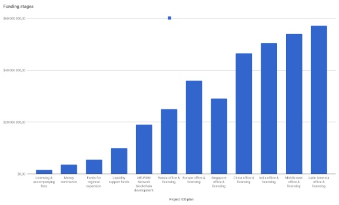

__NEURON Этапы финансирования__

1. Таблица

В зависимости от суммы собранной на ICO NEURON составил план собственного развития\. Минимальная сумма сборов, при которой компания сможет обеспечить получение лицензии на платежную систему, составляет 1,5 млн долларов\. С учетом того, что площадка ICO, Р2Р биржа и модуль пластиковых карт являются уже действующими, NEURON  сможет запустить часть процессов для дальнейшего собственного развития в организации платежного сервиса на блокчейне\. Дальнейшие этапы расписаны в соответствии с объемом финансирования\.

| **Этапы финансирования**              |                   |
|---------------------------------------|-------------------|
| **Stages**                            | **ICO Funding**   |
| Licensing & accompanying fees         | "$1 500 000,00"   |
| Money remittance                      | "$3 500 000,00"   |
| Funds for regional expansion          | "$5 500 000,00"   |
| Liquidity support funds               | "$10 000 000,00"  |
| NEURON Network blockchain development | "$19 000 000,00"  |
| Russia office & licensing             | "$25 000 000,00"  |
| Europe office & licensing             | "$36 000 000,00"  |

2. График 1 \-  Сумма инвестиций в проект по этапам \- план сбора и этапы развития\.

