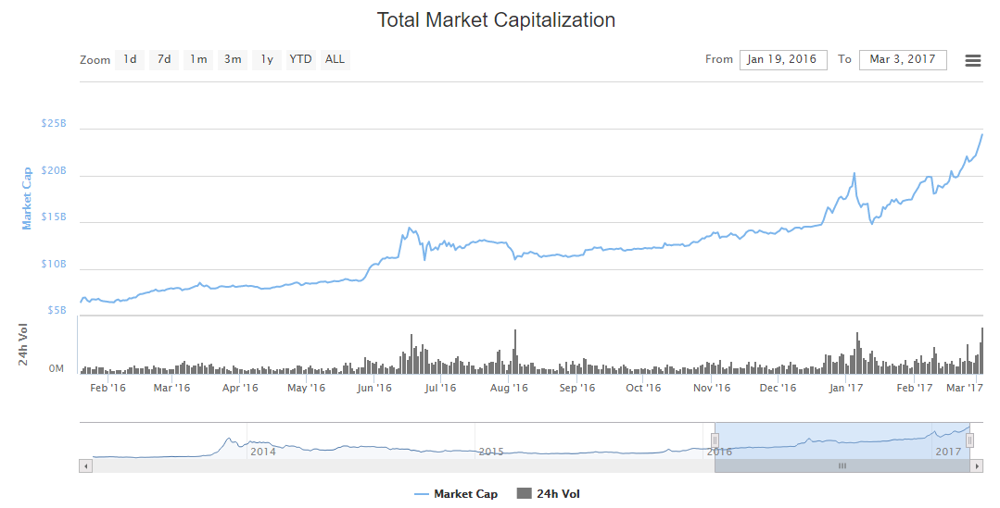
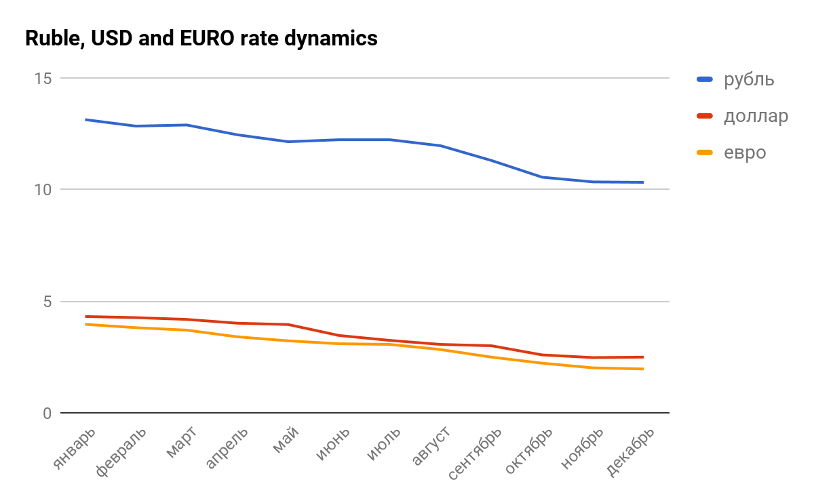
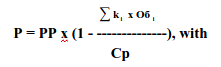
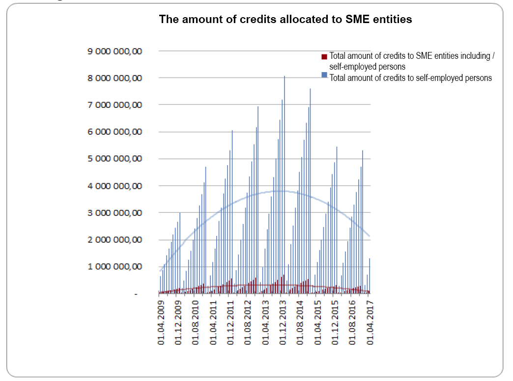
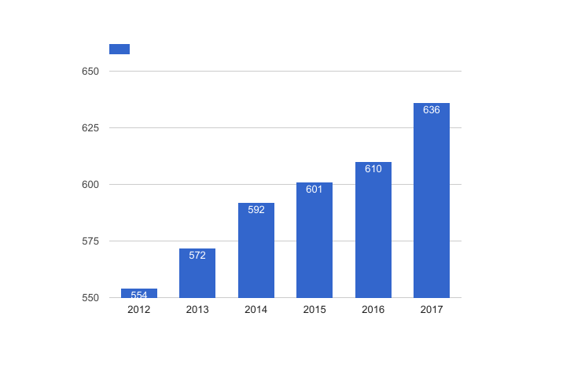
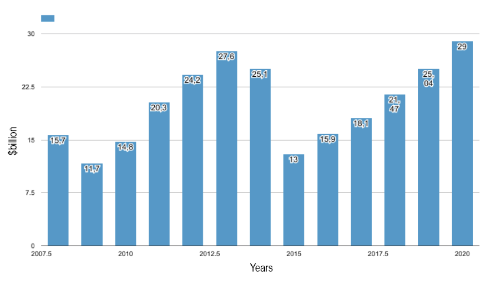
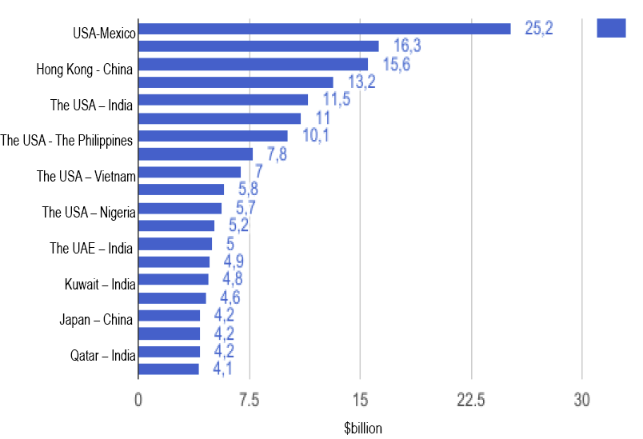

Table of Contents

[1\. Overview](#_hyf2534tmxbh)

[2\. General overview of the financial services market](#_b22j6se4savy)

[3\. Cryptocurrencies growth ratio](#_1owtss566cj9)

[4\. Advantages and risks of keeping your money in cryptocurrencies](#_o6wh19r8txeu)

[5\. Bank deposit analysis](#_xczrwl9iz36a)

[6\. Comparison of bank deposits and cryptocurrencies profitability](#_wk3cr6t3fnvv)

[7\. The problems of small and medium\-sized enterprises \(hereinafter referred to as SME\) in modern global banking services](#_q9fhp3aqur)

[8\.    Money remittance in modern world](#_43ki539ppsm6)

[9\.    International money remittance market](#_xhq1ont5rbte)

[10\. Development of the Russian remittance market](#_dovja0d1sepe)

[11\. International expansion as a way of developing and insuring profile business and remittance systems](#_649igiboa390)

[12\. Business diversification to enhance the sustainability of business](#_5jrb7nvaia66)

[More than $809 billion is set to switch to the fledgling instant payments system in Europe by 2027,](#_pkeqgccc147)	

#### 1\. Overview

#### 2\. General overview of the financial services market

Industry experts believe that today’s global financial services market is on the verge of fundamental change\. With old school techniques being dropped away, many recognize the need for new technology but only the best few implement it\. However, new technology is yet to seep into our daily lives\. Having caught on with the technically savvy, the notions of *blockchain, cryptocurrency *and* smart contracts *quietly creep into the minds of bank officers and even government officials\. Thus, for example, Ripple have signed a cooperation agreement with a number of top banks, among them BBVA; Japan has adopted a special law recognizing bitcoin as a payment instrument\. Australia, New Zealand, Switzerland and Sweden are considering draft bills to legalize cryptocurrencies; Saudi Arabia and some US states have officially recognized crypto\-currencies and even smart contracts\. These developments cannot but have a certain impact on the aggregate value of cryptocurrencies, yet they cannot shape their final value\. While the total value of crypto\-currency reached $90 billion in May 24, 2017 \(an almost twofold increase versus the beginning of 2017\), the figure was only $67\.2 billion at the end of May\.

Traditional markets of banking and finance, to a great extent, continue to operate in a very inert and conservative fashion\. Nevertheless, there *are* banks that realize the need to integrate new technology into platforms they use; some of those even venture into funding start\-ups\. Besides, banking institutions are heavily regulated entities and thus, in trying to be client\-friendly, the banking world finds itself up against an artificial obstacle\. At the end of the day, absolutely all technologies that modern banks run on are nothing more than inventions of 60s and 70s of the last century, with all processes being rather obsolete, non\-transparent, costly and slowed down\. Strangely enough, with the world’s latest developments at the service of man, there are around two billion people who still have no access to banking services whatsoever, a fact confirmed by a number of authoritative studies\. NEURON founders are confident that by integrating modern technology into the current banking processes we stand a good chance of creating a new, cutting\-edge and sought\-after product\. 

#### 3\. Cryptocurrencies growth ratio

Those who are already familiar with cryptocurrencies are well aware of associated advantages and risks\. And still, the changing market capitalization curve, shown in the diagram below, looks very indicative\. 

#### 4\. Advantages and risks of keeping your money in cryptocurrencies

Today, cryptocurrencies are a tool that allows one to both save up and earn passively\. Most of us have heard the story of two pizzas being bought in 2010 for 10,000 BTC \(bitcoins\), a today’s equivalent of $20 million\. One should not forget that this market is fraught with risks \- cryptocurrencies are a highly volatile medium and, as it happens in traditional financial markets, one may risk losing a fortune in one go\.

Investors and traders are driven by different motives investing in cryptocurrencies\. Some decisions to invest in Ethereum were influenced by the Enterprise Ethereum alliance’s successful partner strategy\. Others chose to invest in Ripple, the third largest asset in the cryptocurrency market, whose successes are attributed to partnerships with the Japanese bank consortium and other leading financial institutions\.

A large number of individual and institutional investors alike have treated bitcoin as a sort of safe haven investment that would help avoid financial instability\. Certain investment companies like, for example, Fidelity Investments, have been studying the bitcoin and Ethereum potential through mining them as well as through testing two\-layer solutions such as Lightning and btc micro\-payments\.

If demand grows higher for digital currencies and investors start to treat them as a viable alternative to the existing financial systems, the cryptocurrency market may well outgrow the trading volumes of major stock exchanges\.

#### 5\. Bank deposit analysis

Predictable results have been obtained in the analysis of the selected bank deposit statistics published monthly\. Banks have dropped deposit interest rates across three major types of currencies \(ruble, USD and EURO\)\.

The data on 2016 interest rates’ dynamics have been obtained as follows: five banks that offered highest interest rates were selected monthly and an arithmetic mean was calculated for those interest rates\. The findings are detailed in the table and the diagram below\.

| Month     | Ruble | USD   | EURO  |
|-----------|-------|-------|-------|
| January   | 13.13 | 4.31  | 3.96  |
| February  | 12.84 | 4.26  | 3.81  |
| March     | 12.89 | 4.18  | 3.70  |
| April     | 12.45 | 04.01 | 3.40  |
| May       | 12.14 | 3.95  | 3.22  |
| June      | 12.23 | 3.46  | 03.09 |
| July      | 12.23 | 3.24  | 03.06 |
| August    | 11.96 | 03.06 | 2.83  |
| September | 11.30 | 3.00  | 2.49  |
| October   | 10.55 | 2.59  | 2.22  |
| November  | 10.34 | 2.47  | 02.01 |
| December  | 10.32 | 2.49  | 1.96  |

  

The graphs in the diagram above show interest rates on deposits falling over the course of the year: ruble deposits by 2\.81% in absolute terms or 27\.2% in relative terms; USD deposits by 1\.82% in absolute terms or 73% in relative terms, EURO by 2% in absolute terms or 102% in relative terms\. With respect to ruble deposits, the rates plummeted in the wake of the cut by the Bank of Russia of its base rate by 0\.5% on September 19, 2016, which, for that matter, was a predictable result\. While August saw the interest rates’ average arithmetic hovering at 11\.96%, in October it went down to 10\.55%\.

So, what is the outlook for interest rates dynamics in the mid\-term perspective \(4\-7 months\) before another reduction in the base rate is announced? Will the reduction be sluggish, or will we see stagnation in interest rates? While a reduction in the base rate will surely lead to a sharp drop in deposit rates, mere expectations for the Bank of Russia to reduce its base rate might trigger tangible fluctuations in deposit rates\.

What can be expected of foreign currency deposit interest rates? The unacceptably low figures could be attributed to a depressed import demand, and, as a consequence, banks not needing to keep much foreign currency in its accounts\. Should we see an economic revival or a relaxation of economic sanctions, things could turn around boosting interest rates on foreign currency deposits\. It would be fair to say that banks in many other countries have offered no better terms with respect to deposits\. England’s majors such as Nationwide BS, Derbyshire, Scottish Widows Bank \(members of Lloyds Banking Group and FSCS\) offer 2% per annum \(a minimum of 1,000 £ is accepted\) for long\-term savings and 1,5% per annum for short\-term deposits\. 

Canada’s top banks AcceleRate and Financial Achieva Financial provide depositors at most a 2% per annum in interest\. A few banks \(PC Financial being one of them\) welcome clients willing to deposit money at 1\.35% per annum in savings programs\. Israel’s mainstays, Leumi and Hapoalim, follow suit with interest rates on shekel deposits and savings plans ranging between mere 1\.70% and 2\.25% per annum\. 

#### 6\.	Comparison of bank deposit interest rates vs cryptocurrency profitability

 

In this section, we could have provided detailed diagrams, but the really huge difference between deposit rates and the profitability of cryptocurrencies would not have allowed us to demonstrate the bank rate to the reader\. However, we should not forget that nosedives and losses are always possible in a cryptocurrency market\. Unlike in the deposit market, the government does not guarantee the value of cryptocurrencies; it is not even recognized in most countries\.

 

#### 7\.	The problems of small and medium\-sized enterprises \(hereinafter referred to as SME\) in modern global banking services

The introduction and adoption of Basel III standards imposed tougher regulations on traditional banks by the central banks of the Basel III Standard Member States\. This resulted in increased requirements to the reliability of credit institutions’ capital, and, as a result, in growing reserves created by credit institutions to cover for deposited assets\. See as an example, a formula for the reserve calculation: 

P \- minimum reserve amount \(the reserve amount, which will be reflected in the bank’s balance sheet and impact the size of the bank’s capital\)\. The reserve amount actually formed by the credit organization may not be less than the minimum reserve amount;

 РР \- the estimated reserve amount\. The amount of the reserve expressly set by the regulator;

ki \- collateral quality rate \(index\)\. ki \(k\_1\) is taken equal to one \(1,0\) to denote the quality rate I collateral\. ki \(k\_2\) is taken equal to 0\.5 to denote the quality rate II collateral, with different types of collateral falling into relevant categories of quality per regulator’s instructions;

Обi is the cost of providing the appropriate quality category \(after deducting the estimated costs of the credit organization related to the sale of collateral\);

Cp \- is the amount of principal debt loan\.

If the amount ki х Обi ≥ Ср \(i\.e\. if the value of the collateral exceeds the loan amount\), then P is taken to be equal to zero \(0\)\.

We saw it happen in the USA in 2008, a year after the mortgage crisis, and we saw it happen in Russia in 2014\. What results did it produce in practice? Few SME companies are able to provide the first or the second category quality collateral, so that the cost of collateral is equal to or is twice the loan size\. In their turn, banks reduced investment in "risky" assets, a category into which SME loans have started to fall for that matter\. It brought about the following results for the SME \- the scope of SME lending permanently declined for several years and inched up only in the second quarter of 2016\.

__Figure \- The amount of SME loans__

Source \-FR Central Bank[http://www\.cbr\.ru/statistics/udstat\.aspx?TblID=302\-17](http://www.cbr.ru/statistics/udstat.aspx?TblID=302-17)

Against this backdrop, SME business has either to seek funding for development from alternative sources, or to wind up\.

The overall figures are as follows: the share of SME loans in the portfolio of banks accounts for 56\-59%\. SME lending rates remain at 14\-16% per year, on the one hand, depriving private investors from decent earnings, and on the other hand, being too high for a business to develop\.

The remaining option of individual contributions to small business, as a form of investment, was mostly inaccessible to a wide range of investors\. NEURON proposes a solution to the problem\. We pool together the interests of business and investors in our platform\. As we bring together both of them, an investor has the right to decide to which decent business he/she can entrust savings\. We do not just offer blockchain crowdinvesting per se\! We look further and offer a much broader and more promising avenue — we have created a platform for ICO and invite the crypto community to directly participate in the economy\. It enables SME to attract an additional circle of investors: individuals who have been denied access before\. For the crypto community, we cultivate opportunities to translate crypto currency into being applied in the real economy\. 

#### 8\.    Money remittance in modern world

                    	        	        	                    	

In the near future the global remittance market will demonstrate a clear positive dynamics, despite the slowdown observed from 2014, which was caused by economic instability and tough government measures to control illegal flows of immigrants, in the key traditional and new immigration centers — the United States, Western Europe, Russia\. The World Bank is rather optimistic in its expectations of a 4% market growth in the next few years \(data of 2013\)\. If we see the national economies in the recipient countries recover at a slow pace, a more pessimistic scenario is possible: market expansion will occur at a moderate pace of 2\-2\.5% per year, according the American research and advisory firm Aite Group\.

Source: World Bank data

__Figure \- The development of global remittance market in 2012\-2020, bln\. USD__

#### 9\.    International money remittance market

Labor migration stimulated by the continuing globalization of the world economy will remain the main growth driver for this market\. It will be deterred by further tightening of immigration policy in the main foreign labor recipient countries provoked by the ongoing social disasters in the world \(military conflicts in the Middle East and North Africa, increased terrorist attacks worldwide, etc\.\)\. In addition, enhanced restrictive measures may encourage emergence of illegal remittance channels\. Yet, in 2017\-2020, the global structure of remittance flows is unlikely to change\. According to the estimates of the World Bank, the USA, Saudi Arabia, Germany, Russia and the U\.A\.E\. will be the largest remittance source countries in the period from 2016 to 2020, while India, China, the Philippines, Mexico and Nigeria will remain among the main recipients\. For the underdeveloped countries \(Tajikistan, Kyrgyzstan, Nepal, Libya, etc\.\) the remittance in the foreseeable future will continue to play the role of a major external source of resources\. It should be noted that the remittance market has significant influence on rapid development of digital technology, which is sure to intensify in the future\. According to the latest data, more than 80% of families in the world own at least one mobile phone\. The annual growth in the number of unique users worldwide is approximately 3\.4%\. As for the Internet, according to the International Telecommunication Union \(ITU\), over 3 billion people \(that is more than 40% of the total world population\) used it in 2015\. New technical financial solutions are becoming more available to consumers, including migrant workers\. As a result, the electronic payment systems are increasingly gaining popularity \(for example, TransferWise, Azimo, CurrencyFair, Sircle etc\.\) providing for peer\-to\-peer money transfers\. Yet, global and local players \(Western Union, Money Gram, Ria Financial Services, etc\.\) are also actively developing, introducing new technology\-based products and services, diversifying their business\. Moreover, new players formally carry out their activity in the territory of several countries, but in fact, at the moment, each of them is based in the country of origin \(and, in some cases, in the neighboring friendly countries\)\. Time and substantial financial resources are what new market players are going to need in order to win strong market positions in the segment of international remittance and to edge out the old\-timers and, therefore, the balance of forces is expected to remain in the near future\.

#### 10\.	Development of the Russian remittance market

The development of the Russian international remittance market in 2017\-2020 will follow the global trends\. Despite the sector’s drastic shrinkage in 2015, caused by a combination of post\-crisis negative factors, a gradual recovery trend is expected in 2017\. Yet the market will only reach the pre\-crisis 2013 level in 2019\. The rates of 2014 should not be taken into account, as a relatively high figure was reached due to the panic among migrant workers in the wake of the ruble’s nosedive, which provoked mass international remittance\.

__Figure \- Dynamics of the Russian international remittance market in 2008\-2020, bln\. USD__

			

Sources: data of the Bank of Russia, the International Migration Organization                                               	

The key factor defining the market growth in the forecast period will be the return of labor migrants to Russia from the CIS countries, the main international remittance source\. The main reason for re\-emigration is devaluation of national currencies in the CIS countries, including the major suppliers of labor migrants to Russia \(Kazakhstan, Uzbekistan, Tajikistan, Kyrgyzstan, Moldova\) which followed the ruble drop in 2014\-2015\. As a consequence, the Russian market started to attract the citizens of the CIS countries again, including in the light of gradual economic improvement in this country\. Another reason why Russia still attracts migrants are complications associated with employment in other highly competitive migration destinations \(Middle East, North America, Australia\) where there are set requirements with respect to the knowledge of foreign languages and certain qualifications, which the natives of the CIS countries generally do not possess\. At the same time, the unemployment rate in some countries, such as Kyrgyzstan, Tajikistan and Uzbekistan, continues to grow\. The conditions of official stay in the Russian Federation growing tougher may also trigger an additional inflow of illegal migrants and, accordingly, lead to the expansion of informal remittance channels\.

Thus, the CIS countries in the near future will remain the main strategic remittance destination\. But at the same time, new international corridors will be explored with a view to expanding business\.

With regard to the balance of powers in the Russian market, the position of the absolute market leader, the Russian Zolotaya Korona/Money Transfers system \(over 40%\) is quite strong, but there is increased remittance activity on the part of large infrastructure players, such as Sberbank and Russian Post, which in the future can provoke a market reshuffle, edging out Russian and foreign players\. The emergence of new ‘walk\-on’ players on the market is highly unlikely for reasons related to the low profitability of the core business and market entry barriers being tightened, in particular, the recent introduction of new regulations for non\-bank lending institutions by the main regulator\.

#### 11\.	International expansion as a way of developing and insuring the core business and remittance systems

Foreign expansion, in particular, to the promising markets beyond the former Soviet Union, can become a potential line of development for Russian remittance systems in the near future\. It is not just about expanding the network of cash pick\-up locations through cooperation with banks and other local players, but about establishing a full\-fledged presence on the markets, just as the cases are with Western Union or Money Gram\. A good incentive for entering foreign markets is provided by continued growth of historic remittance corridors \(for example, the United States \- Mexico, Saudi Arabia \- India\) and emergence of new global economy routes induced by changes, for example, China \- African nations, countries of Western Europe \- China, etc\. Should another recession occur in the domestic market, such projects can be used as a conditional war chest by the operators\. Foreign corridors will develop regardless of the situation in the Russian Federation, being dependent only on local factors\.

However, high costs can be a negative aspect associated with the presence expansion\. This is due, primarily, to a fairly long\-term process of adaptation to the new jurisdiction, as well as to the existing settlement and payment infrastructure\. The effect of international projects is usually delayed, which cannot be afforded by all Russian players\. At the same time, foreign markets, depending on the level of their development and local unique characteristics, can become the proving ground for testing new solutions with the subsequent introduction in other markets\.

International remittance market

Source: World Bank data

__Figure — TOP 20 key corridors of cross\-border remittance in the world, bln\. USD __

#### 12\.	Business diversification as the basis for more sustainable business

In the new environment, the mono business associated with the provision of traditional international remittance services has ceased to be competitive\. Consequently, the sector may further shrink due to disappearance of smaller \(mostly local\) systems from the market\.

The market players that are backed by or are a part of large financial organizations with diversified business or government agencies stand the highest chance of retaining their positions\. The emergence of new ‘classical’ players in the near future is only possible through the entry of advanced remittance systems to the Russian market\.

However, almost all players are currently in active search for additional sources of revenue \(payments, payment cards, etc\.\)\. The so\-called synergy effect \(online and offline\) projects, that involve players operating in *adjacent *financial and consumer markets, may turn out especially promising\.

“Zolotaya Korona/Money Transfers”, “Unistream”, Western Union, Money Gram, “Leader” and other Russian players in the remittance market, as it was previously noted, have already started or are in the process of launching similar solutions\.

The cross\-border online payments \(cash transfers to legal entities\) and related services currently developed by remittance systems may become an additional e\-business area in the context of active trade market development \(650 billion dollars in 2016, of which 20% is accounted for by purchases in international online stores, according to Data Insight\)\. Subject to active development of e\-business in 2017\-2020, we may expect a gradual outflow of remittance customers, including migrant workers, into the newly accessible online channels:

 | Finance                    | Communication    | Retail Trade              |
 |----------------------------|------------------|---------------------------|
 | Banks                      | Mobile operators | Network retailers         |
 | Insurance companies        | Postal operators | Big stand-alone retailers |
 | Broker companies           | Social networks  |                           |
 | Card payment systems       |                  |                           |
 | Electronic payment systems |                  |                           |

High\-margin solutions may include both totally new products and services, and the existing ones upgraded to meet new demands\. This will be accompanied by the convergence of various services \(“one\-stop shop” format\), the gradual replacement of classical remittance services with transactions via e\-money or bank cards \(mainly debit or prepaid\)\. Ultimately, universal platforms, marketplaces, will be established to host all settlement parties: individuals \(residents and non\-residents\) and legal entities \(payees for goods and services, and banking organizations accepting personal loan payments\)\.

The currently fragmented existing e\-infrastructures will continue to evolve against the background of channel modification\. The potential consolidation of advanced market players will enable integration of the existing channels and creation of new ones whereby a single payment domain will come into existence featuring numerous heteromorphic access points \(smartphone, personal computer, payment terminal\)\.

 

#### 

#### 

#### More than $809 billion is set to switch to the fledgling instant payments system in Europe by 2027, representing a significant threat to cards, according to a new report from Ovum, a London\-based consultancy\. Instant, or real\-time, payments enable account\-to\-account bank transfers in seconds instead of days\.

*Banking Technology*‘s sister publication[*Paybefore*](http://paybefore.com/) summarises the report\.

Ovum’s “Instant Payments and the Post PSD2 Landscape” research has found that instant payments will account for more than $337 billion worth of European e\-commerce transactions in 2027\.

Most of the instant payment activity will come from the UK, Germany and the Netherlands\. Already, 59% of banks in Western Europe plan to increase spending on their payments infrastructure to support that future, according to Ovum\.

The report, which was commissioned by payments technology company Icon Solutions, also covered Europe’s revised[Payment Services Directive \(PSD2\)](http://www.bankingtech.com/676451/psd2-who-wins/), which includes regulations in the EU that will affect the competitive landscape for payments\.

“E\-commerce card usage will stagnate at current levels of around $290\.1 billion annually and by 2025, boosted by increased consumer convenience and the lower charges that PSD2 facilitates, instant payments will overtake cards,” Ovum predicts\.

What’s more, the research indicates that instant payments and digital wallets such as[PayPal](http://www.bankingtech.com/841632/paypal-gets-its-fingers-all-over-google-chromes-shopping/) will stand as the two dominant payment methods across Europe as early as 2024\.

Instant payments will absorb up to 72% of e\-commerce transactions in the Netherlands, to just under 20% in Italy, in the coming years\.

“PSD2 and other open banking initiatives are a golden opportunity for retail banks to re\-imagine their products and services, and ensure they are fit for purpose in tomorrow’s digital ecosystem,” says Kieran Hines, head of industries at Ovum\.

“In particular, those banks that combine early adoption of instant payments infrastructure with a proactive approach to PSD2 compliance and a focus on the payment needs of both merchants and consumers will be the ones that enjoy the most rapid growth over the coming years\.”

Все это дает нам основание рассчитывать на то, что NEURON, с помощью своей кроссчейн платформы, сможет предоставить финансовому миру “реализовать себя” в новых условиях\. Финансовая платформа NEURON  сможет стать тем который: \- « will be the ones that enjoy the most rapid growth over the coming years\.”

For instance, in the past 12 months, the most popular and widely utilized wallet platform Blockchain has added more users \(seven mln\) than it did throughout the seven\-year period from 2009 to 2016\. Discussions and complaints on the rapidly rising fees of Bitcoin transactions completely ignore some of these statistics that demonstrate the unexpectedly fast growth of the Bitcoin network\.

