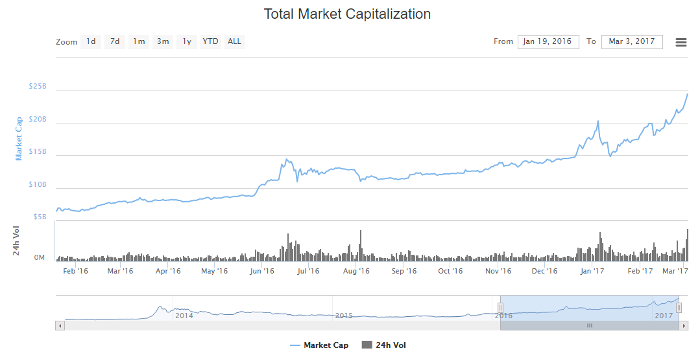
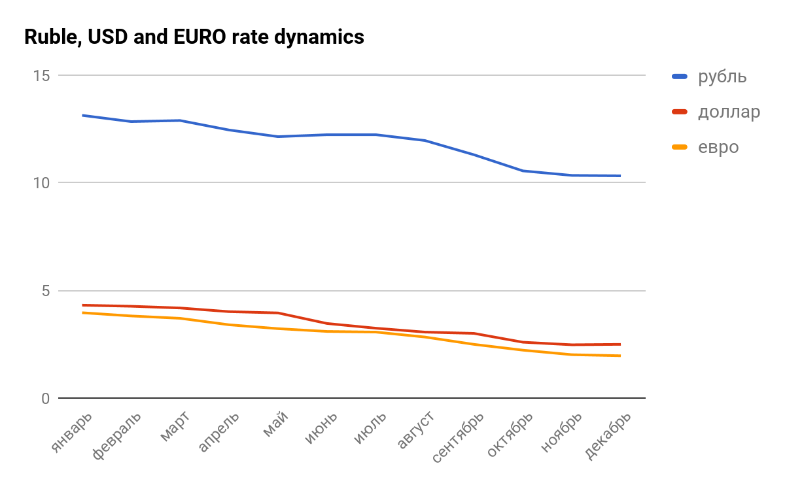

__Среда в которой существует NEURON__

__Оглавление__

1. [Введение](#_hyf2534tmxbh)
2. [Общее представление о рынке финансовых услуг](#_b22j6se4savy)
3. [Рост криптовалют, динамика роста криптовалют](#_1owtss566cj9)
4. [Преимущества и риски размещения средств в криптовалюты](#_o6wh19r8txeu)
5. [Аналитика банковских вкладов](#_xczrwl9iz36a)
6. [Сравнение доходности банковских вкладов с доходностью криптовалют](#_flnxvukevwf1)
7. [Проблемы Малого и среднего бизнеса \(далее\- МСБ\) в современном мире банковских услуг](#_eat28wwx84g)
8. [Денежные переводы в современном мире](#_4edkz16gbtqf)
9. [Рынок международных денежных переводов](#_3906tohxytdn)
10. [Развитие российского рынка денежных переводов](#_hni242jhj8xq)
11. [Международная экспансия как способ развития и страхования профильного бизнеса систем денежных переводов](#_6w7x0h57nfz3)
12. [Диверсификация бизнеса для повышения устойчивости бизнеса](#_iz2sh7rl88l5)
13. [More than $809 billion is set to switch to the fledgling instant payments system in Europe by 2027,](#_pkeqgccc147)

#### 1. Введение

#### 2. Общее представление о рынке финансовых услуг

Сегодняшний рынок финансовых услуг, по мнению многих экспертов рынка, находится в переломной стадии, когда старые методы и технологии отходят, необходимость новых осознано многими, внедряются лучшими, но все еще, не вошли  в повседневный обиход\. Такие понятия, как блокчейн, криптовалюты, смарт\-контракты постепенно входят не только в частную жизнь энтузиастов, но в умы и сознание крупных банковских структур и государств\. Так,  Ripple подписал соглашение со многими крупными банками, такими, как BBVA, Япония приняла закон о признании Биткоина в качестве платежного инструмента, Австралия, Новая Зеландия, Швеция, Швейцария, рассматривают проекты законодательств о легализации криптовалют, Саудовская Аравия, некоторые штаты США уже признали криптовалюты и даже смарт\-контракты\. Все это не может не отражаться на совокупной стоимости криптовалют, но и не может окончательно повлиять на их стоимость\. Так, если по состоянию на 24 мая 2017 совокупная стоимость криптовалют достигала отметки в $90 млрд\., увеличившись с начала 2017 года, почти в два раза,  то концу мая данный показатель составлял уже всего $67,2 млрд\.

Традиционный банковский финансовый рынок продолжает, в большей степени, оставаться очень инертным и консервативным\. Тем не менее, некоторые банки понимают необходимость внедрения новых технологий в свои платформы и даже инвестируют в стартапы\. Кроме того, деятельность традиционных банков сильно подвержена влиянию регуляторов\. Таким образом, возникает искусственный тормоз развития банковского мира в направлении “к клиенту”\. Все технологии, применяемые сегодня традиционными банками, основаны на “изобретениях” 60\-70 годов прошлого века, что влечет за собой сложность и непрозрачность процессов, их дороговизну и медлительность\. Уникальность этой ситуации добавляет то, что, не смотря на современное развитие мира, по оценке некоторых авторитетных изданий, не охваченными банковскими услугами остаются, порядка, 2 млрд человек\. Так что, по мнению создателей NEURON, если совместить традиционные банковские процессы с современными технологиями, можно сделать современный, востребованный продукт\. 

#### 3. Рост криптовалют, динамика роста криптовалют

Для тех, кто знает, что такое криптовалюты, не стоит рассказывать про преимущества и риски\. Тем не менее, график изменения общей капитализации рынка на март 2017 г\.  выглядит весьма показательно\. 

#### 4. Преимущества и риски размещения средств в криптовалюты

На сегодняшний день, криптовалюты — это тот инструмент, который позволяет не только сохранять сбережения, но и пассивно зарабатывать\. Всем известен пример, когда в 2010 году была куплена пицца за 10000 ВТС \(биткоинов\), сегодня эта сумма эквивалентна $20 млн\. Конечно, нельзя забывать и о рисках этого рынка — волатильность криптовалют очень большая и, как и на любом другом финансовом рынке, можно в момент потерять очень много\.

Инвесторы и трейдеры инвестируют в криптовалютный рынок по разным причинам\. Некоторые из них инвестировали в Эфириум из\-за успешной партнёрской стратегии, продемонстрированной альянсом Enterprise Ethereum\. Другие инвестировали в Ripple, третий по величине актив на криптовалютном рынке, успех которого был достигнут благодаря партнёрству с Японским банковским консорциумом и другими ведущими финансовыми институтами\.

Большое количество как случайных, так и институциональных инвесторов инвестировали в биткоин как в “безопасное убежище для денег”, с тем, чтобы уйти от финансовой нестабильности\. Некоторые инвестиционные компании, например, Fidelity Investments, активно изучают потенциал биткоина и эфириума путём их майнинга, а также путём тестирования таких двухслойных решений, как Lightning и микроплатежи btc\.

Если спрос на цифровые валюты будет увеличиваться, а инвесторы начнут воспринимать их как альтернативу существующим финансовым системам, то рынок криптовалют по объёму может превзойти торги на основных фондовых биржах\.

#### 5. Аналитика банковских вкладов

Анализ публикуемой ежемесячно подборки банковских вкладов дал ожидаемый  результат\. Процентные ставки по вкладам в трех основных видах валют \(рубли, доллары США, евро\)  снизилась\.

Данные по динамике процентных ставок за 2016 год были получены следующим образом: за каждый месяц было выбрано 5 предложений банков с наибольшими процентными ставками, после чего вычислялось среднее арифметическое значение процентной ставки\. Результаты представлены ниже в таблице и на графиках\.

__Динамика процентных ставок по депозитам__ 

| месяц    | рубль | доллар США | евро |
|----------|-------|------------|------|
| январь   | 13,13 | 4,31       | 3,96 |
| февраль  | 12,84 | 4,26       | 3,81 |
| март     | 12,89 | 4,18       | 3,7  |
| апрель   | 12,45 | 4,01       | 3,4  |
| май      | 12,14 | 3,95       | 3,22 |
| июнь     | 12,23 | 3,46       | 3,09 |
| июль     | 12,23 | 3,24       | 3,06 |
| август   | 11,96 | 3,06       | 2,83 |
| сентябрь | 11,3  | 3          | 2,49 |
| октябрь  | 10,55 | 2,59       | 2,22 |
| ноябрь   | 10,34 | 2,47       | 2,01 |
| декабрь  | 10,32 | 2,49       | 1,96 |

  

Из приведенных графиков видно, что за год процентные ставки по вкладам упали, причем по вкладам в Рублях на 2,81% в абсолютном значении или 27,2%, Долларах США — на 1,82% в абсолютном значении или 73%, евро — на 2% в абсолютном значении или 102%\. По вкладам в Рублях ставки особенно резко упали после снижения ЦБ РФ 19 сентября 2016 г\. ключевой ставки на 0,5%, что, впрочем, было вполне ожидаемо\. Так, если в августе среднее арифметическое процентной ставки составляло 11,96%, то в октябре — уже 10,55%\.

Какова же перспектива динамики процентных ставок в среднесрочной перспективе \(4\-7 месяцев\) до очередного снижения значения ключевой ставки? Будет ли снижение вялотекущим, или же мы увидим стагнацию процентных ставок? За снижением ключевой ставки последует резкое падение ставок по вкладам\. Ощутимое их снижение может наблюдаться уже только на ожиданиях возможного снижения ЦБ РФ ключевой ставки\.

Что же ждать от процентных ставок по вкладам в иностранной валюте? Их откровенно низкий уровень объясняется низким уровнем импорта, и, как следствие, отсутствием у банков потребности в валюте\. С оживлением экономики и смягчением экономических санкций все может измениться, и процентная ставка по вкладам в иностранной валюте будет увеличиваться\.

Справедливости ради надо сказать, что ситуация с вкладами во многих других странах не намного лучше\. Ведущие банки Великобритании, такие как Nationwide BS, Derbyshire, Scottish Widows Bank \(члены Lloyds Banking Group и FSCS\) предлагают долгосрочные сберегательные программы максимум под 2% годовых \(минимальный баланс – 1000 £\) и краткосрочные вклады под 1,5% годовых\. 

В топовых канадских банках, таких как AcceleRate и Financial Achieva Financial процентный доход также не превышает 2% годовых\. А некоторые банки \(PC Financial, например\) предлагают вкладчикам открыть долгосрочные накопительные программы под 1,35%\. Приблизительно такая же ситуация в ведущих банках Израиля — Leumi и Poalim — ставки по шекелевым вкладам и накопительным программам колеблются от 1,70% до 2,25%\. 

#### 6. Сравнение доходности банковских вкладов с доходностью криптовалют

В этом разделе мы могли бы привести графики, но колоссальная разница в ставках не позволит отразить банковскую ставку для обозрения\. Но, не стоит забывать, что на рынке криптовалют всегда присутствует возможность падения и больших потерь\. В отличие от рынка вкладов, стоимость криптовалюты не только не гарантирована государством, но и не признана большинством государств\.

#### 7. Проблемы Малого и среднего бизнеса \(далее\- МСБ\) в современном мире банковских услуг

Введение в действие и принятие стандартов Базель III, привело к ужесточению регулирования деятельности традиционных банков со стороны  центральных банков стран\-участниц стандарта Базель III\. Это вылилось в повышение требований к надежности капитала кредитных организаций и, как результат, увеличению резервов, создаваемых кредитными организациями, под размещенные активы\. В качестве примера, формула расчета резерва: 

 Р — минимальный размер резерва \(именно та величина резерва, которая будет отражена в балансе банка и оказывать влияние на размер капитала банка\)\. Фактически формируемый кредитной организацией резерв, не  может быть меньше минимального размера резерва,;

 РР — размер расчетного резерва\. Величина резерва директивно установленная регулятором;

 ki — коэффициент \(индекс\) категории качества обеспечения\. Для обеспечения 1  категории качества ki \(k\_1\) принимается равным единице \(1,0\)\. Для обеспечения II категории качества ki \(k\_2\) принимается равным 0,5, при этом различные виды обеспечения распределены по соответствующим категориям качества регулятором и опять же директивно;   

  Обi — стоимость обеспечения соответствующей категории качества \(за вычетом предполагаемых   расходов   кредитной   организации,   связанных   с  реализацией обеспечения\);

 Ср — величина основного долга по ссуде\.

Если Сумма ki х Обi ≥ Ср \(т\.е\. если стоимость обеспечения превышает размер кредита\), то Р принимается равным нулю \(0\)\.

В Америке это произощло в 2008 году после ипотечного кризиса, в России \- в январе 2014 года\. Как это отразилось на практике? Единицы компаний сектора МСБ могут предоставить первую или вторую категорию качества обеспечения, да еще и так, чтобы стоимость обеспечения была равна или перекрывала сумму кредита в два раза\. Банки, в свою очередь, сократили вложения в “рисковые” активы, к которым стали относить кредиты МСБ\. Чем это результировалось для МСБ — объемы кредитования малого и среднего бизнеса перманентно снижались на протяжении нескольких лет и только во втором квартале 2016 произошел небольшой рост\. 

__Рисунок \- Объем предоставленных кредитов субъектам малого и среднего предпринимательства\.__

Источник \- ЦБ РФ [http://www\.cbr\.ru/statistics/udstat\.aspx?TblID=302\-17](http://www.cbr.ru/statistics/udstat.aspx?TblID=302-17)

 Таким образом, МСБ вынужден изыскивать возможность получения средств для развития из альтернативных источников, либо закрываться\.

Общие цифры таковы: доля кредитов МСБ в портфеле банков составляет 56 – 59%, ставки по кредитованию МСБ остаются на уровне 14 – 16% годовых, что, с одной стороны, не дает возможности достойного заработка частным инвесторам, с другой — чрезмерна для бизнеса с точки зрения его развития\. 

Оставшийся вариант индивидуальных вложений в малый бизнес, как инвестиции, ьоставался весьма закрытым для широкого круга инвесторов\. NEURON предлагает решить эту проблему\. На своей площадке мы совмещаем интересы бизнеса и инвесторов, мы находим обоих и право инвестора решить, в какой достойный бизнес он готов разместить свои сбережения\. Мы не просто предлагаем Краудинвестинг на Блокчейне\! Мы смотрим и предлагаем гораздо более широкое и перспективное направление — мы создали платформу для ICO и привлекаем криптомир для непосредственного участия в экономике\. Для МСБ это дает возможность привлечь дополнительный круг инвесторов\-физических лиц, который ранее был закрыт для него, а для криптомира — это возможность перевести криптовалюту в реальную экономическую плоскость применения\.

#### 8. Денежные переводы в современном мире

Мировой рынок денежных переводов в ближайшем будущем будет демонстрировать явную положительную динамику, несмотря на замедление темпов роста, наблюдаемое с 2014 г\., которое было вызвано экономической нестабильностью и ужесточением государственных мер, направленных на контроль нелегальных потоков переселенцев, в ключевых традиционных и новых миграционных центрах — США, западной Европе, РФ\. Всемирный Банк настроен достаточно оптимистично и ожидает в ближайшие несколько лет рост рынка на уровне 4% \(показатель 2013 г\.\)\. В случае медленного восстановления национальных экономик принимающих стран возможно более пессимистичное развитие событий: расширение рынка будет происходить умеренными темпами — 2 – 2,5% в год, в соответствии с прогнозами американской аналитической компании Aite Group\. 

Источник: данные Всемирного Банка 

Рисунок \- Развитие глобального рынка денежных переводов в 2012\-2020 гг\., млрд\. долларов США 

#### 9. Рынок международных денежных переводов 

Основным драйвером роста продолжит оставаться трудовая миграция, стимулируемая продолжающейся глобализацией мировой экономики\. Сдерживающим фактором станет дальнейшее ужесточение миграционной политики в основных странах\-реципиентах иностранной рабочей силы, спровоцированное происходящими социальными катаклизмами в мире \(военные конфликты в Северной Африке и на Ближнем Востоке, усиление террористических атак по всему миру и т\.д\.\)\. Кроме того, усиление ограничительных мер может привести к росту популярности нелегальных каналов денежных переводов\. Однако в течение 2017\-2020 гг\. глобальная структура потоков денежных переводов вряд ли изменится\. США, Саудовская Аравия, Германия, РФ и ОАЭ станут основными странами\-отправителями денежных переводов в период с 2016 по 2020 гг\. по оценкам Всемирного Банка, а получателями – Индия, Китай, Филиппины, Мексика и Нигерия\. Для слаборазвитых стран \(Таджикистан, Киргизии, Непала, Ливии и др\.\) поступающие денежные переводы в обозримом будущем продолжат играть роль крупного внешнего источника ресурсов\. Необходимо отметить, что на рынок денежных переводов оказывает существенное влияние быстрое развитие цифровых технологий, которое в будущем только усилится\. По последним данным Euromonitor более 80% семей в мире владеют хотя бы одним мобильным телефоном\. Ежегодно рост числа уникальных пользователей по всему миру составляет примерно 3,4%\. Что касается Интернета, то согласно данным Международного союза электросвязи \(ITU\), свыше 3 млрд\. человек \(что составляет более 40% всего населения мира\) уже в 2015 г\. пользовались Интернетом\. Новые технические финансовые решения становятся все более доступны потребителям, в том числе и трудовым мигрантам\. Вследствие чего все большую популярность набирают электронные платежные системы \(например, TransferWise, Azimo, Сircle, CurrencyFair и др\.\) позволяющие осуществлять пиринговые денежные переводы\. Но глобальные и локальные игроки \(Western Union, Money Gram, Ria Financial Services и др\.\) также активно развиваются, внедряя новые технологичные финансовые продукты и услуги, диверсифицируя свой бизнес\. Кроме того, новые игроки официально осуществляют свою деятельность на территории ряда стран, но фактически, на данный момент деятельность каждого из них сосредоточена на территории страны происхождения \(и в ряде случаев в соседних дружественных государствах\)\. Для того, чтобы новым участникам занять прочные рыночные позиции в сегменте международных отправлений и потеснить классических участников потребуется время и существенные денежные вливания, поэтому в ближайшем времени существенных изменений в расстановке сил не ожидается\. 

#### 10. Развитие российского рынка денежных переводов

Российский рынок международных денежных переводов в 2017\-2020 гг\. в своем развитии будет следовать мировым тенденциям\. Несмотря на существенное сжатие сектора в 2015 г\., вызванное целым комплексом негативных факторов, обусловленных экономическим кризисом, в 2017 г\. можно ожидать начало постепенного восстановления направления\. При этом рынок достигнет уровня докризисного 2013 г\. только в 2019 г\. Значение 2014 г\. не принимается в расчет, так как условно высокий показатель был достигнут за счет паники среди трудовых мигрантов после резкого ослабления курса рубля, которая спровоцировала массовые международные отправления\. 

Рисунок \- Динамика российского рынка международных денежных переводов в 2008\-2020 гг\., млрд\. долларов США 

			

Источники: данные Банка России, Международной организации миграции					

Ключевым фактором роста рынка в прогнозируемом периоде станет возврат трудовых мигрантов в РФ из стран СНГ – основных отправителей международных денежных переводов\. Основная причина реэмиграции – последовавшая после падения курса рубля в 2014\-2015 гг\. девальвация национальных валют в странах СНГ, в том числе в основных странах\-поставщиках трудовых мигрантов в РФ \(Казахстан, Узбекистан, Таджикистан, Киргизия, Молдова\)\. Вследствие чего российский рынок снова стал привлекателен для граждан стран СНГ, в том числе на фоне постепенного улучшения экономической ситуации в стране\. Другой причиной, интереса к РФ стали сложности, связанные с трудоустройством в других высококонкурентных миграционных центрах \(Ближний Восток, Северная Америка, Австралия\), где требуется знание иностранных языков и определенная квалификация, которой, выходцы из стран СНГ, как правило не имеют\. При этом, уровень безработицы в ряде стран, например, Киргизии, Таджикистане и Узбекистане, продолжает расти\. Усложнение условий \(официального\) пребывания в РФ также могут спровоцировать увеличение потока нелегальных мигрантов, и соответственно активизацию и расширение неофициальных каналов\. 

Таким образом, страны СНГ в ближайшее время останутся главным стратегическим направлением для отправления денежных переводов\. Но параллельно будет происходить освоение новых международных коридоров с целью расширения бизнеса\. 

Что касается расстановки сил на российском рынке, то позиции абсолютного лидера рынка – российской системы «Золотая Корона – Денежные Переводы» \(свыше 40%\) достаточно прочны, но усиление активности в сегменте денежных переводов со стороны крупных инфраструктурных игроков – Сбербанка и Почты России –, которые в будущем могут спровоцировать рыночную рокировку, потеснив российских и иностранных игроков\. Появления новых игроков «с улицы» вряд ли возможно по причинам, связанным с низкой рентабельностью профильного бизнеса и ужесточения барьеров для входа на рынок, в частности введение новых нормативов для НКО мегарегулятором\. 

#### 11. Международная экспансия как способ развития и страхования профильного бизнеса систем денежных переводов 

Потенциальным направлением развития российских систем денежных переводов в ближайшем будущем, как уже говорилось, может стать зарубежная экспансия, в частности на перспективные рынки стран дальнего зарубежья\. Имеется ввиду не расширение выплатной зоны посредством сотрудничества с банками и другими локальными игроками, а полноценное присутствие на рынках, аналогично моделям Western Union или Money Gram\. Стимулом для выхода на зарубежные рынки является продолжающийся рост исторически сложившихся коридоров переводов \(например, США – Мексика, Саудовская Аравия – Индия\) и появление под влиянием изменений мировой экономической конъюнктуры новых магистралей, например, Китай – страны Африки, страны Западной Европы – Китай и др\. В случае очередного ухудшения ситуации на внутреннем рынке, подобные проекты смогут стать условной страховой подушкой для оперирующих компаний\. Зарубежные коридоры будут развиваться независимо от ситуации в РФ, имея зависимость только от локальных факторов\. 

Однако, негативным моментом, связанным с расширением присутствия могут стать высокие издержки\. Это связано, в первую очередь, с достаточно долгосрочным процессом адаптации к новой юрисдикции, а также к существующей расчетно\-платежной инфраструктуре\. Эффект от международных проектов будет, как правило, отложенным, что себе позволить смогут не все российские игроки\. При этом, зарубежные рынки, в зависимости от уровня своего развития и локальных уникальных характеристик, могут стать полигоном для опробирования новых решений с последующим внедрением на других рынках\.

Рынок международных денежных переводов 

Источник: данные Всемирного Банка 

Рисунок — ТОП 20 ключевых коридоров трансграничных переводов в мире, млрд\. долларов США 

#### 12. Диверсификация бизнеса для повышения устойчивости бизнеса 

В новой среде монобизнес, связанный с оказанием традиционных услуг международных переводов перестал быть конкурентоспособным\. Вследствие чего может продолжиться сжатие сектора за счет ухода более мелких \(преимущественно локальных\) систем переводов с рынка\. 

Наиболее высокие шансы остаться на своих позициях будут у участников, которые принадлежат крупным финансовым организациям с диверсифицированным бизнесом или госструктурам\. Появление новых «классических» игроков в ближайшем будущем возможно только за счет выхода на российский рынок технологичных систем денежных переводов\. 

Однако в настоящий момент практически все игроки ведут активный поиск источников дополнительных доходов \(платежи, платежные карты и т\.д\.\)\. Особо перспективными могут стать так называемые синергитические \(онлайн и оффлайн\) проекты с игроками со смежных финансовых и потребительских рынков\. 

«Золотая Корона – Денежные Переводы», «Юнистрим», Western Union, Money Gram, «Лидер» и другие российские игроки рынка денежных переводов, как отмечалось ранее, уже запустили или находятся в стадии запуска подобных решений\. 

Дополнительным электронным направлением на фоне активного развития рынка Интернет\-торговли \(650 млрд\. долларов в 2016 г\., из которых ~20% \- покупки в зарубежных онлайн магазинах, по данным Data Insight\) также могут стать осваиваемые системами денежных переводов трансграничные онлайн платежи \(переводы денежных средств юридическим лицам\) и сопутствующие сервисы\. В случае активного развития электронного бизнеса в 2017\-2020 гг\. возможен постепенный переток клиентов систем денежных переводов, в том числе трудовых мигрантов, в новые доступные онлайн каналы:

| Направление «Финансы»         | Направление «Связь» | Направление «Розничная торговля» |
|-------------------------------|---------------------|----------------------------------|
| Банки                         | Мобильные операторы | Сетевые ритейлеры                |
| Страховые компании            | Почтовые операторы  | Крупные несетевые ритейлеры      |
| Брокерские компании           | Социальные сети     |                                  |
| Карточные платежные системы   |                     |                                  |
| Электронные платежные системы |                     |                                  |

 Высокомаржинальными решениями могут оказаться как абсолютно новые продукты и услуги, так и модернизированные с учетом новых потребностей существующие предложения\. При этом будет происходить конвергенция различных сервисов \(формат «единого окна»\), постепенное замещение классических денежных переводов на транзакции, осуществляемые с помощью электронных денег или банковских карт \(преимущественно дебетовых или предоплаченных\)\. В итоге, будут сформированы универсальные площадки – маркет\-плейсы – для всех участников расчетов – физических лиц \(резидентов и нерезидентов\) и юридических лиц \(получателей платежей за товары и услуги и банковских организаций в части приема платежей по кредитам физических лиц\)\. 

На фоне изменения каналов будет происходить постепенная модификация существующей электронной инфраструктуры, которая на данный момент является достаточно разрозненной\. Потенциальная консолидация технологичных рыночных игроков позволит интегрировать существующие каналы и создать новые для формирования единого платежного пространства с многочисленными и разноформатными точками доступа \(смартфон, личный компьютер, платежный терминал\)\. 

#### 

#### 13. More than $809 billion is set to switch to the fledgling instant payments system in Europe by 2027, 

representing a significant threat to cards, according to a new report from Ovum, a London\-based consultancy\. Instant, or real\-time, payments enable account\-to\-account bank transfers in seconds instead of days\.

*Banking Technology*‘s sister publication[*Paybefore*](http://paybefore.com/) summarises the report\.

Ovum’s “Instant Payments and the Post PSD2 Landscape” research has found that instant payments will account for more than $337 billion worth of European e\-commerce transactions in 2027\.

Most of the instant payment activity will come from the UK, Germany and the Netherlands\. Already, 59% of banks in Western Europe plan to increase spending on their payments infrastructure to support that future, according to Ovum\.

The report, which was commissioned by payments technology company Icon Solutions, also covered Europe’s revised[Payment Services Directive \(PSD2\)](http://www.bankingtech.com/676451/psd2-who-wins/), which includes regulations in the EU that will affect the competitive landscape for payments\.

“E\-commerce card usage will stagnate at current levels of around $290\.1 billion annually and by 2025, boosted by increased consumer convenience and the lower charges that PSD2 facilitates, instant payments will overtake cards,” Ovum predicts\.

What’s more, the research indicates that instant payments and digital wallets such as[PayPal](http://www.bankingtech.com/841632/paypal-gets-its-fingers-all-over-google-chromes-shopping/) will stand as the two dominant payment methods across Europe as early as 2024\.

Instant payments will absorb up to 72% of e\-commerce transactions in the Netherlands, to just under 20% in Italy, in the coming years\.

“PSD2 and other open banking initiatives are a golden opportunity for retail banks to re\-imagine their products and services, and ensure they are fit for purpose in tomorrow’s digital ecosystem,” says Kieran Hines, head of industries at Ovum\.

“In particular, those banks that combine early adoption of instant payments infrastructure with a proactive approach to PSD2 compliance and a focus on the payment needs of both merchants and consumers will be the ones that enjoy the most rapid growth over the coming years\.”

Все это дает нам основание рассчитывать на то, что NEURON, с помощью своей кроссчейн платформы, сможет предоставить финансовому миру “реализовать себя” в новых условиях\. Финансовая платформа NEURON  сможет стать тем который: \- « will be the ones that enjoy the most rapid growth over the coming years\.”

For instance, in the past 12 months, the most popular and widely utilized wallet platform Blockchain added more users \(seven mln\) than it did throughout the seven\-year period from 2009 to 2016\. Discussions and complaints on the rapidly rising fees of Bitcoin transactions completely ignore some of these statistics that demonstrate the unexpectedly fast growth of the Bitcoin network\.

