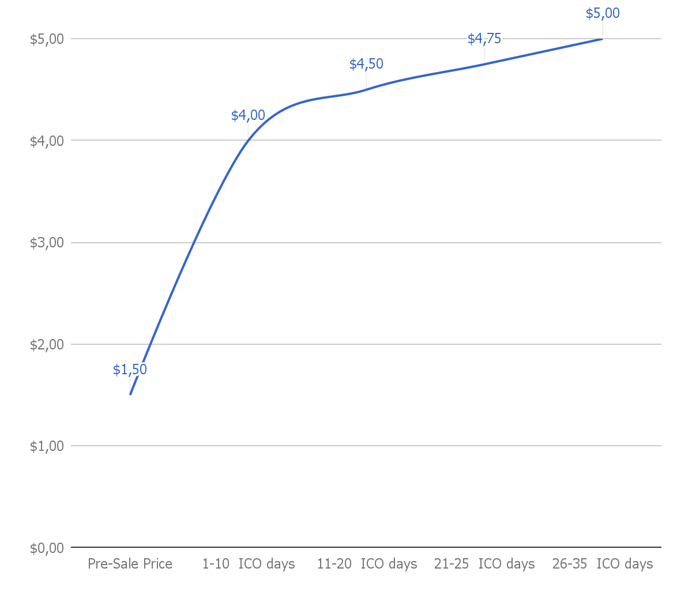
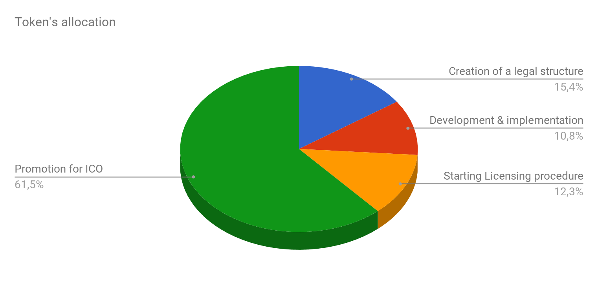

__Pre\-Sale__

1. NEURON Pre\-sale table

NEURON заинтересован в своих первых инвесторах и предоставляет скидку на приобретение токенов на ранней стадии в размере 70% от цены на ICO. Вложив средства на этой стадии, инвесторы смогут получить 333% прироста своих вложений в очень короткий промежуток времени.

| Neuron pre sale                 |                     |
|---------------------------------|---------------------|
| Total Neurons for sale          | "NRN 7 276 664,60"  |
| ICO's first decade discount NRN | "17,03%"            |
| NRN for Bonuses                 | "NRN 1 672 307,22"  |
| Amount of NRN for Pre-sale      | "NRN 433 333,33"    |
| Discount for pre sale           | 70%                 |
| Pre-Sale Price                  | "$1,50"             |

2. NRN price dynamics

3. Token allocation

| Распределение токенов         | %      | NRN      |         |
|-------------------------------|--------|----------|---------|
| Creation of a legal structure | 15.4%  | NRN 66   | 666.67  |
| Development & implementation  | 10.8%  | NRN 46   | 666.67  |
| Start Licensing procedure     | 12.3%  | NRN 53   | 333.33  |
| Promotion for ICO             | 61.5%  | NRN 266  | 666.67  |
|                               | 100.0% | NRN 433  | 333.33  |

4. Diagram

